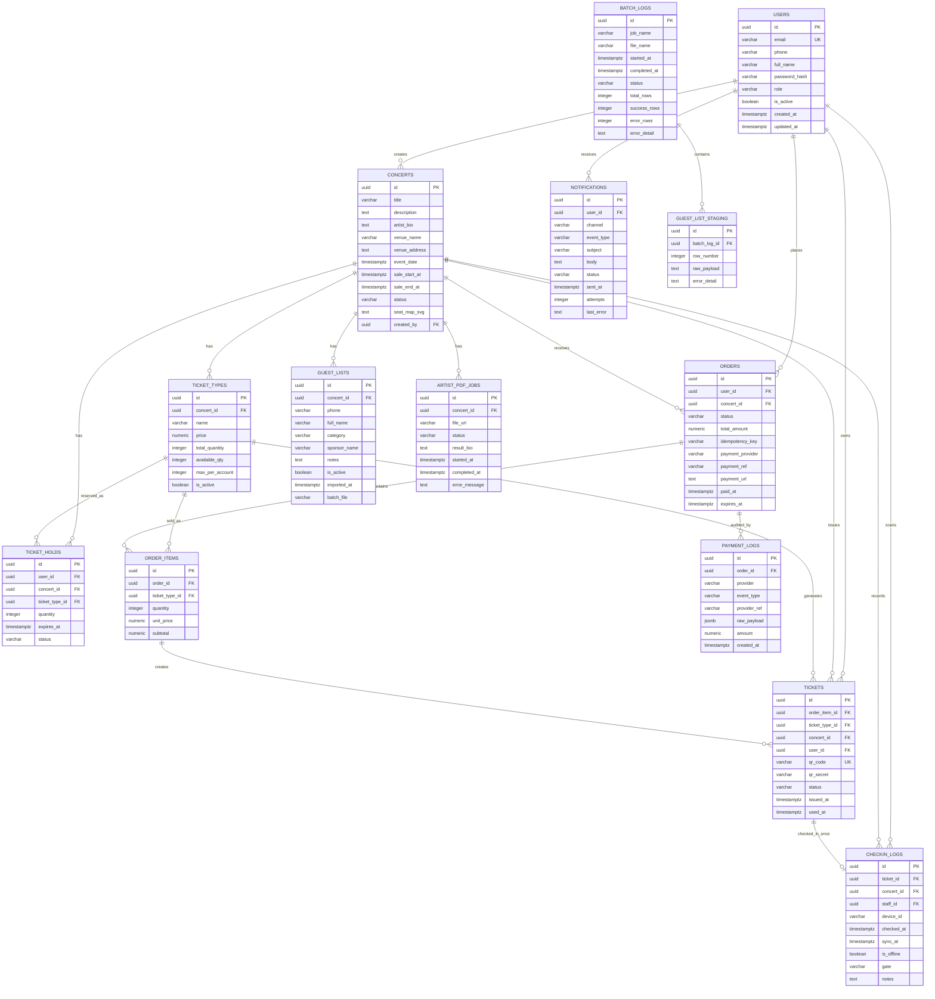

# TicketBox Data Model / ERD

ERD tập trung vào các entity quan trọng của TicketBox: user/role, concert, ticket type, order, payment log, ticket, check-in log, guest list, notification và AI artist bio job.

## Data Store Decision

TicketBox dùng PostgreSQL làm nguồn dữ liệu chính vì luồng bán vé cần ACID transaction, foreign key, unique constraint và audit log. Redis được dùng cho cache, token bucket rate limiting, idempotency key, waiting room/queue state và lock ngắn hạn. SQLite được dùng trên mobile scanner để lưu dataset vé và pending check-in logs khi thiết bị mất mạng.

## ERD

## Ràng Buộc Quan Trọng

| Ràng buộc | Mục đích |
|---|---|
| `users.email` unique | Không cho đăng ký trùng email |
| `ticket_types.available_qty >= 0` | Chống tồn kho âm |
| `orders(user_id, idempotency_key)` unique | Chống tạo order trùng do retry |
| `payment_logs(order_id, event_type)` unique | Chống xử lý trùng callback success/failure |
| `tickets.qr_code` unique | Mỗi e-ticket có QR riêng |
| `checkin_logs.ticket_id` unique | Một ticket chỉ được check-in một lần |
| `guest_lists(concert_id, phone)` unique | Một khách mời không bị nhập trùng trong cùng concert |
| `ticket_holds(user_id, concert_id, ticket_type_id)` unique | Một user chỉ có một hold active theo concert/ticket type |

## Ghi Chú Thiết Kế

- `ticket_types.available_qty` được lưu sẵn để phục vụ inventory hot path; không tính lại bằng cách scan order mỗi request.
- `order_items.unit_price` và `subtotal` là snapshot tại thời điểm mua để giữ đúng lịch sử giá.
- `payment_logs.raw_payload` phục vụ audit/reconcile khi payment gateway gửi callback bất thường.
- `checkin_logs` là trạng thái server cuối cùng; SQLite trên mobile chỉ là bộ đệm offline.
- `guest_lists` được upsert từ CSV theo `(concert_id, phone)`, còn `batch_logs` và `guest_list_staging` lưu bằng chứng import.
- `artist_pdf_jobs` tách trạng thái xử lý AI khỏi bảng `concerts`; chỉ khi organizer apply kết quả thì `concerts.artist_bio` mới đổi.
