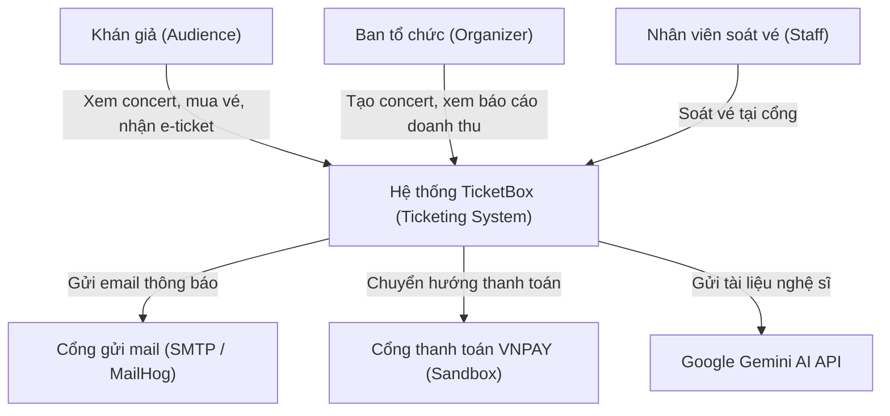
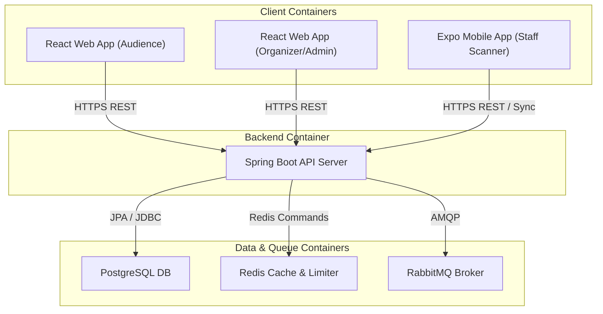
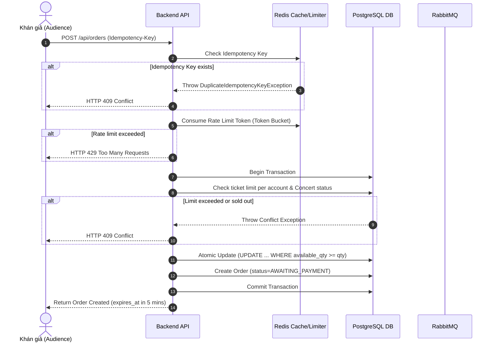
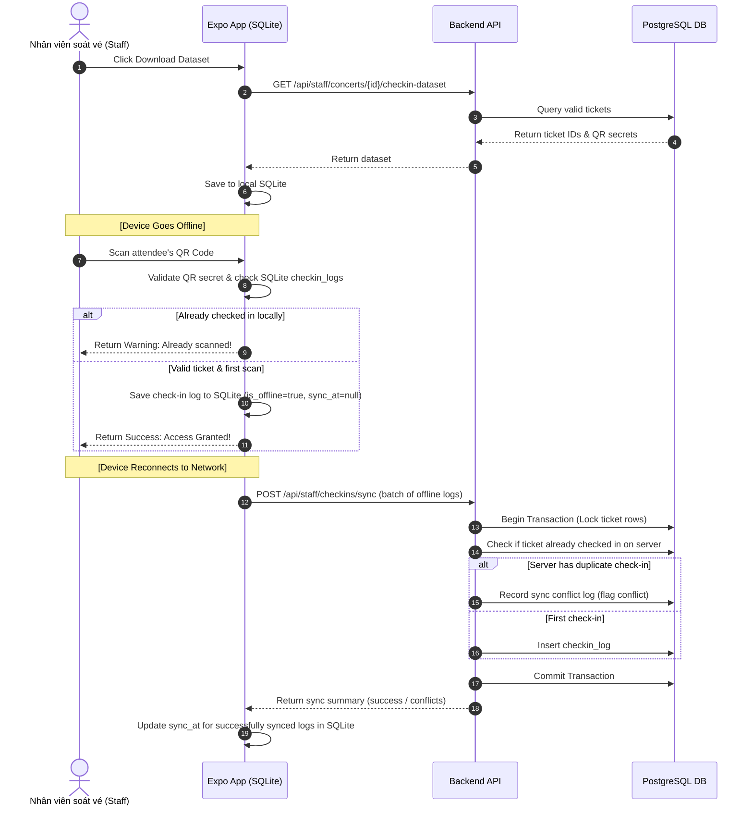

# TicketBox - Technical Design

This document details the system design, components, database schemas, access controls, protection mechanisms, and architectural decision records for the TicketBox platform.

---

## 1. Overall Architecture
TicketBox uses a **Modular Monolith** architecture built on top of Spring Boot. It leverages Spring Modulith to enforce logical boundaries between business domains, ensuring high cohesion and low coupling while remaining easy to deploy and test.

### Technology Stack
*   **Backend:** Java 21, Spring Boot 3.3.5, Spring Security, Spring Modulith, Spring Batch 5, Resilience4j.
*   **Database:** PostgreSQL (primary SQL store), Flyway (database migrations).
*   **Cache & Rate Limiting:** Redis (caching and token bucket rate limiting).
*   **Message Broker:** RabbitMQ (asynchronous notification queuing).
*   **Frontend Web:** React (Vite), Axios, TailwindCSS.
*   **Mobile Scanner:** React Native (Expo) with SQLite for offline data persistence.

---

## 2. C4 Diagrams

### Level 1 - System Context

### Level 2 - Container

---

## 3. High-Level Integration Flows

### A. Ticket Purchase Lifecycle & Double-Spend Prevention

### B. Offline Gate Check-In & Sync Flow

---

## 4. Database Schema
TicketBox uses PostgreSQL. Schema creation is managed by Flyway. Major entities include:
*   `users`: Stores user login and role details (`AUDIENCE`, `ORGANIZER`, `STAFF`, `ADMIN`).
*   `concerts`: Stores event details and generated `artist_bio`.
*   `ticket_types`: Tracks configuration (price, quantity, limit per account) and current `available_qty` per zone.
*   `orders`: Represents purchases and hold statuses.
*   `order_items`: Maps quantities bought per ticket type in an order.
*   `tickets`: Issued individual ticket entries with unique QR code payload.
*   `checkin_logs`: Tracks entries, device IDs, online/offline status, and timestamps.
*   `payment_logs`: Audits gateway callbacks.
*   `guest_lists`: Import database for sponsor guests.
*   `batch_logs`: Audits Spring Batch job runs.
*   `artist_pdf_jobs`: Audits PDF AI bio processing jobs.

---

## 5. Access Control (RBAC)
We enforce Role-Based Access Control at the API and UI layers.

### User Roles
1.  `AUDIENCE`: Public website access. Can purchase tickets, view their own orders, and download e-tickets.
2.  `STAFF`: Mobile scanner login. Can download concert check-in datasets, perform online scans, and batch sync offline logs.
3.  `ORGANIZER`: Create/edit concerts and ticket configurations. View reports, import CSV guest lists, trigger AI artist bio jobs.
4.  `ADMIN`: Full system control (including managing user roles/statuses).

### Backend Enforcement
*   Enforced in `SecurityConfig.java` using Spring Security request matchers.
*   Method-level security can be added using `@PreAuthorize` where required.
*   API responses strictly use the unified format: unauthenticated requests return `HTTP 401` with `ErrorResponse`, and unauthorized requests return `HTTP 403` with `ErrorResponse`.

---

## 6. System Protection Mechanisms

### A. Rate Limiting (Token Bucket)
*   **Mechanism:** Implemented in `TokenBucketRateLimiter.java` using a Redis Lua script.
*   **Algorithm:** Smooth-refill token bucket (tokens are refilled proportionally based on elapsed milliseconds).
*   **Endpoint Application:** Intercepts `POST /api/orders` (Purchase) and `/api/payments/**` (Payment) using `PurchasePaymentRateLimitInterceptor`.
*   **Fallback Behavior:** Under heavy load, if Redis is overloaded or unavailable, the rate limiter fails open (logs a warning and allows requests) to prevent a full system outage.

### B. Circuit Breaker (Resilience4j)
*   **Application:** Bocks calls to the payment gateway (VNPAY Sandbox) in `PaymentService`.
*   **Triggers:** If the VNPAY endpoint times out or returns error statuses continuously (failure rate threshold 50% over sliding window of 5 calls), the circuit breaker transitions from `CLOSED` to `OPEN`.
*   **Graceful Degradation:** When the circuit breaker is `OPEN`, payment initiation request falls back immediately to `MOCK` payment provider or returns `HTTP 503` with a friendly error message, keeping other services (like viewing concerts or ticket availability) fully operational.

### C. Idempotency Key
*   **Usage:** Mandatory header `Idempotency-Key` for `POST /api/orders`.
*   **Storage:** Redis key with format `idempotency:order:<key>`, holding the response payload with a Time-To-Live (TTL) of 24 hours.
*   **Conflict Resolution:** If a duplicate key is sent within 24 hours, the server returns the cached response instead of creating a second order, preventing double charging.

### D. Caching & Availability Checking
*   **Strategy:** Cache-aside pattern using Redis for public concert list (`GET /api/concerts`) and details view.
*   **Real-time Availability:** The client queries `/api/concerts/{id}/ticket-types` using **polling every 3 to 5 seconds** during ticket sale rushes. This endpoint fetches active values from the database (updated atomically during orders) to balance real-time accuracy and caching.

---

## 7. Technical Decision Records (ADRs)

### ADR 01: SQL Database for Transactional Core
*   **Decision:** PostgreSQL was chosen as the primary transactional database instead of a NoSQL database.
*   **Rationale:** Ticket sales require strict ACID properties to guarantee no double-selling and correct inventory counts.
*   **Trade-off:** Slower than NoSQL under extreme write load, which is mitigated by Redis rate-limiting and optimistic database locking on the inventory check.

### ADR 02: Modular Monolith vs. Microservices
*   **Decision:** Spring Boot modular monolith over microservices.
*   **Rationale:** Small team size and tight schedule. A modular monolith simplifies deployment (single container) and testing while maintaining code isolation via Spring Modulith.

### ADR 03: Polling over WebSockets for Availability Checks
*   **Decision:** Polling (3-5s) instead of WebSockets.
*   **Rationale:** Easier to scale under load, as stateless HTTP GETs can be cached easily via Redis and CDN, whereas maintaining 80,000 persistent WebSocket connections consumes massive server memory.
