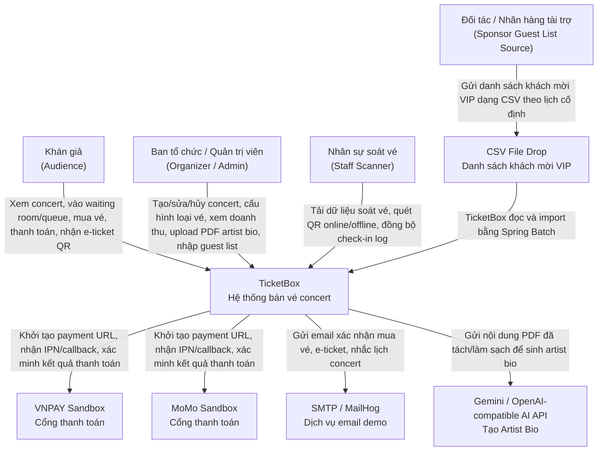
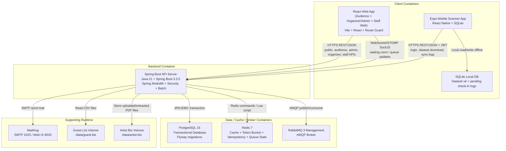
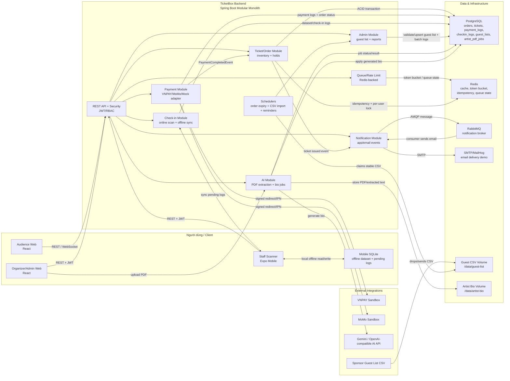
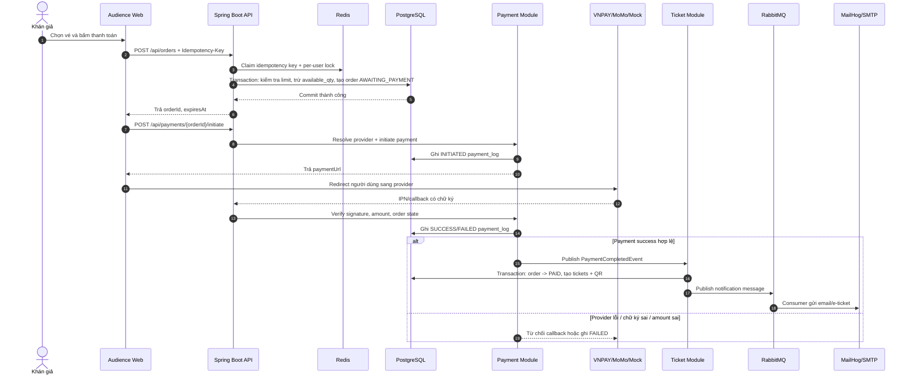
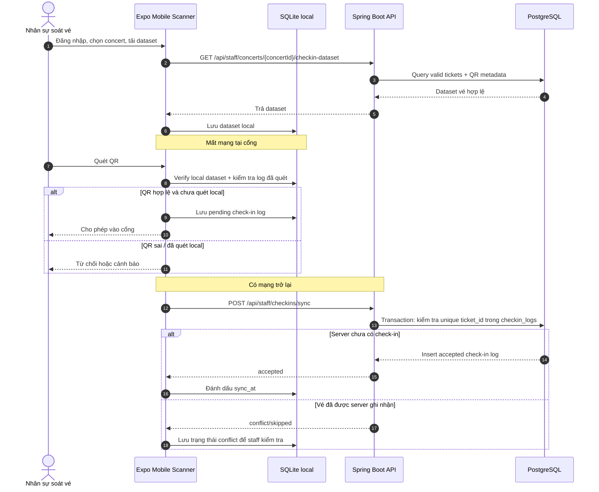
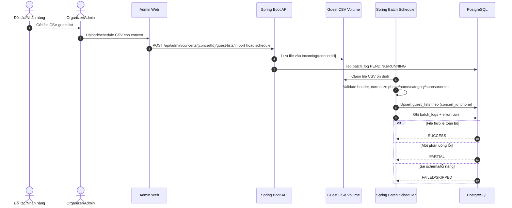
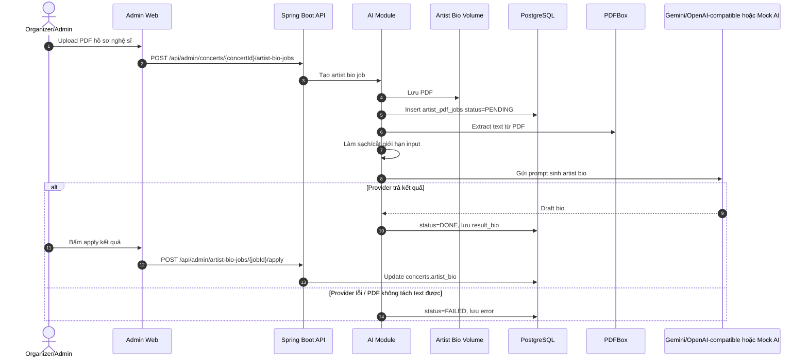

# TicketBox - Technical Design

## 1. Mục tiêu kiến trúc

TicketBox là hệ thống bán vé concert có các điểm rủi ro chính: lượng truy cập tăng đột biến khi mở bán, tranh chấp vé cuối cùng, thanh toán qua cổng ngoài không ổn định, soát vé trong môi trường mạng yếu, nhập danh sách khách mời bằng CSV và xử lý hồ sơ nghệ sĩ bằng AI. Kiến trúc được chọn phải đáp ứng đồng thời ba mục tiêu:

1. Giữ luồng mua vé và thanh toán nhất quán, không oversell, không phát hành vé trùng.
2. Cô lập lỗi ở các tích hợp ngoài như VNPAY/MoMo, SMTP/MailHog, AI provider và file CSV để không kéo sập toàn bộ hệ thống.
3. Dễ demo, dễ kiểm thử và phù hợp quy mô đồ án, nhưng vẫn có ranh giới module rõ ràng để có thể tách dịch vụ trong tương lai.

Vì vậy TicketBox sử dụng kiến trúc **Modular Monolith** trên Spring Boot. Hệ thống backend được triển khai như một ứng dụng duy nhất, nhưng code được chia theo domain module bằng Spring Modulith: `auth`, `concert`, `ticket`, `payment`, `checkin`, `notification`, `admin`, `ai`, `queue`. Cách tiếp cận này giảm độ phức tạp vận hành so với microservices, đồng thời vẫn giữ được ranh giới nghiệp vụ rõ ràng.

## 2. Technology Stack

| Thành phần | Công nghệ | Vai trò |
|---|---|---|
| Backend API | Java 21, Spring Boot 3.3.5, Spring Modulith, Spring Security, Spring Batch, Resilience4j | Xử lý nghiệp vụ chính, xác thực JWT, phân quyền RBAC, batch CSV, tích hợp payment/AI |
| Web frontend | React, Vite, Axios, TailwindCSS | Giao diện khán giả, trang quản trị organizer/admin, trang staff web |
| Mobile scanner | React Native/Expo, SQLite local storage | Ứng dụng soát vé tại cổng, hỗ trợ tải dataset và ghi nhận check-in offline |
| Database | PostgreSQL, Flyway | Nguồn dữ liệu chính cho user, concert, ticket type, order, payment log, ticket, check-in log, guest list, artist PDF job |
| Cache/Rate limit/Queue state | Redis | Cache concert, rate limiting token bucket, idempotency key, waiting room/queue state |
| Message broker | RabbitMQ | Tách luồng thông báo email khỏi luồng mua vé/thanh toán |
| Payment gateway | VNPAY Sandbox, MoMo | Khởi tạo thanh toán và nhận callback/IPN |
| Email | SMTP/MailHog trong môi trường demo | Gửi email xác nhận mua vé và thông báo |
| AI/PDF | PDFBox, OpenAI-compatible provider | Tách text từ PDF và tạo artist bio |
| File import | Spring Batch, Commons CSV, thư mục guest-list mounted volume | Nhập danh sách khách mời VIP từ CSV theo lịch |
| Dev/Demo runtime | Docker Compose | Chạy PostgreSQL, Redis, RabbitMQ, backend, frontend, MailHog |

## 3. Các thành phần chính và trách nhiệm

### 3.1 React Web Application

Web frontend phục vụ nhiều nhóm người dùng:

- Khán giả xem danh sách concert, xem chi tiết concert, vào waiting room/queue, chọn khu vé, tạo order, thanh toán và xem e-ticket.
- Organizer/Admin tạo và quản lý concert, ticket type, doanh thu, người dùng, notification, guest import và artist bio.
- Staff có thể dùng một số màn hình web hỗ trợ vận hành soát vé.

Frontend giao tiếp với backend qua REST API dưới prefix `/api`. Token JWT được gửi bằng header `Authorization: Bearer <jwt>` cho các API cần đăng nhập. Các màn hình quản trị dùng route guard để kiểm tra role trước khi cho truy cập.

### 3.2 Mobile Scanner Application

Mobile scanner dành cho nhân sự soát vé tại cổng. Ứng dụng gọi API backend để đăng nhập, lấy danh sách concert được phân công và tải dataset soát vé. Dataset hợp lệ được lưu trong SQLite cục bộ để thiết bị vẫn quét QR khi mất mạng.

Khi offline, thiết bị ghi log check-in vào SQLite. Khi có mạng trở lại, app gửi batch log lên backend để đồng bộ. Backend vẫn là nơi quyết định cuối cùng bằng constraint/trạng thái trong PostgreSQL, nên một vé không thể được xác nhận vào cổng hai lần trên server.

### 3.3 Spring Boot API Server

Backend là trung tâm xử lý nghiệp vụ và được tổ chức theo module:

| Module | Trách nhiệm |
|---|---|
| `auth` | Đăng ký, đăng nhập, JWT, hồ sơ người dùng, quản lý user/role |
| `concert` | Quản lý concert, ticket type, seat map, poster, tồn kho vé, dữ liệu công khai |
| `queue` | Waiting room, queue position, admission slot, shopping session TTL |
| `ticket` | Tạo order, giữ vé, kiểm soát giới hạn vé/tài khoản, phát hành e-ticket/QR |
| `payment` | Khởi tạo thanh toán, chọn provider, xử lý VNPAY/MoMo callback, ghi payment log |
| `checkin` | Quét vé online, tải dataset soát vé, đồng bộ check-in offline |
| `notification` | Tạo notification, gửi email sau thanh toán, nhắc concert trước 24 giờ |
| `admin` | Guest list CSV, batch log, báo cáo doanh thu, quản trị vận hành |
| `ai` | Upload PDF, tách text bằng PDFBox, làm sạch text, gọi AI để tạo artist bio |

Các module không truy cập tùy tiện repository của nhau. Module giao tiếp qua public port/interface hoặc domain event. Ví dụ `payment` dùng `OrderPort` của `ticket` để kiểm tra order; `ticket` lắng nghe `PaymentCompletedEvent` để phát hành vé; `notification` nhận thông tin từ payment/ticket qua event và adapter.

### 3.4 PostgreSQL

PostgreSQL là nguồn dữ liệu chính, phù hợp vì các luồng mua vé, thanh toán, phát hành ticket và check-in cần ACID. Các bảng quan trọng gồm `users`, `concerts`, `ticket_types`, `orders`, `order_items`, `tickets`, `payment_logs`, `checkin_logs`, `guest_lists`, `batch_logs`, `artist_pdf_jobs`.

Flyway quản lý migration. Các ràng buộc quan trọng như unique QR/ticket, unique payment log/event và unique check-in theo ticket là lớp bảo vệ cuối cùng để tránh phát hành/ghi nhận trùng trong trường hợp request song song.

### 3.5 Redis

Redis có ba vai trò chính:

- Cache dữ liệu đọc nhiều như danh sách concert, chi tiết concert và availability gần thời gian thực.
- Lưu token bucket/rate limit để giảm tải backend khi lượng người mua vé tăng đột biến.
- Lưu idempotency key và trạng thái waiting room/queue/shopping session dùng chung giữa các request/backend instance.

Redis là thành phần tăng hiệu năng và điều tiết tải, nhưng dữ liệu giao dịch cuối cùng vẫn nằm ở PostgreSQL.

### 3.6 RabbitMQ và notification

RabbitMQ tách luồng gửi thông báo khỏi luồng mua vé/thanh toán. Khi thanh toán thành công và vé được phát hành, backend publish message/event; consumer notification gửi email qua SMTP/MailHog và lưu notification trong database. Nếu email chậm hoặc lỗi tạm thời, order/ticket vẫn đã hoàn tất, không chặn phản hồi chính cho người dùng.

### 3.7 Payment Gateway

Payment module bọc các provider như VNPAY, MoMo sau cùng một abstraction. Khi người dùng thanh toán, backend tạo order/hold vé trước, sau đó khởi tạo payment URL. Callback/IPN từ gateway được xác minh chữ ký, provider reference, số tiền và trạng thái trước khi ghi payment log và phát event hoàn tất thanh toán.

### 3.8 AI Artist Bio

AI module nhận file PDF hồ sơ nghệ sĩ, lưu file, tách text bằng PDFBox, làm sạch text rồi gọi AI provider tương thích OpenAI. Job được ghi trạng thái trong database để có thể xem tiến độ, retry hoặc phục hồi khi lỗi.

### 3.9 Guest List CSV Import

Admin module dùng Spring Batch/Commons CSV để import danh sách khách mời VIP từ file CSV. File được đặt trong thư mục guest-list của container. Batch job kiểm tra schema, validate từng dòng, xử lý trùng lặp/upsert và ghi `batch_logs`. Lỗi CSV không làm gián đoạn luồng mua vé đang chạy.

## 4. Cách các thành phần giao tiếp

| Luồng giao tiếp | Cơ chế | Ghi chú |
|---|---|---|
| Web/Mobile -> Backend | HTTPS REST/JSON | Dùng JWT cho API cần xác thực; response theo format `success/message/data/errors` |
| Web waiting room/queue -> Backend | REST và WebSocket/STOMP SockJS | Cập nhật trạng thái queue/admission trong giai đoạn mở bán |
| Backend -> PostgreSQL | JPA/JDBC transaction | Dùng transaction cho order, inventory, payment log, ticket, check-in |
| Backend -> Redis | Redis command/Lua script | Cache, rate limit, idempotency, queue state |
| Backend -> RabbitMQ | AMQP | Publish/consume message notification |
| Backend -> Payment gateway | HTTPS redirect/callback/IPN | VNPAY/MoMo/mock provider; xác minh callback trước khi đổi trạng thái |
| Backend -> SMTP/MailHog | SMTP | Gửi email sau mua vé và thông báo |
| Backend -> AI provider | HTTPS API | Sinh artist bio từ text đã làm sạch; có mock provider để demo |
| Mobile scanner -> SQLite | Local database | Lưu dataset và pending check-in logs khi offline |
| Spring Batch -> CSV file | File system mounted volume | Đọc guest list theo lịch, validate và import vào PostgreSQL |

## 5. Luồng tích hợp mức cao

### 5.1 Luồng xem concert

Khán giả mở web, frontend gọi `GET /api/concerts`, `GET /api/concerts/{id}` và `GET /api/concerts/{id}/availability`. Backend đọc cache Redis trước với dữ liệu ít thay đổi; nếu cache miss thì đọc PostgreSQL rồi ghi cache. Số vé còn lại có TTL ngắn hoặc invalidate khi order/hold thay đổi để giảm lệch dữ liệu.

### 5.2 Luồng waiting room và mua vé

Trước giờ mở bán, người dùng vào waiting room. Tới `sale_start_at`, backend tạo queue position trong Redis và chỉ cho một lượng người dùng nhất định vào shopping session. Khi tạo order, backend kiểm tra JWT, rate limit, idempotency key, giới hạn vé/tài khoản, trạng thái concert/ticket type và tồn kho. Tồn kho được trừ bằng transaction/atomic update trong PostgreSQL để tránh oversell. Order ở trạng thái chờ thanh toán có `expires_at`; nếu quá hạn, hệ thống giải phóng vé.

### 5.3 Luồng thanh toán và phát hành vé

Sau khi order được tạo, payment module khởi tạo giao dịch với VNPAY/MoMo/mock provider. Khi callback/IPN hợp lệ, backend ghi `payment_logs`, phát event thanh toán thành công và ticket module phát hành e-ticket/QR. Notification module gửi email và thông báo bất đồng bộ qua RabbitMQ.

### 5.4 Luồng soát vé offline

Staff đăng nhập mobile app, tải dataset vé hợp lệ về SQLite. Khi mất mạng, app vẫn quét QR và ghi log cục bộ. Khi online lại, app gửi batch log lên backend. Backend kiểm tra ticket trong PostgreSQL và ràng buộc unique check-in để chấp nhận log đầu tiên, đánh dấu conflict cho log trùng.

### 5.5 Luồng CSV và AI

CSV guest list được Spring Batch đọc theo lịch, validate và import vào PostgreSQL. PDF artist bio được upload qua admin, xử lý async bằng PDFBox và AI provider/mock provider. Hai luồng này là background/ops flow, không nằm trên critical path của mua vé.

## 6. Failure Boundary - ảnh hưởng khi một phần hệ thống bị lỗi

| Thành phần lỗi | Ảnh hưởng trực tiếp | Cách hệ thống giới hạn ảnh hưởng |
|---|---|---|
| Payment gateway VNPAY/MoMo lỗi hoặc timeout | Người dùng không thể khởi tạo/hoàn tất thanh toán qua provider đó | Circuit breaker/timeout trong payment module; concert browsing, queue, admin, check-in vẫn hoạt động; order chờ thanh toán có thể hết hạn và trả vé |
| Redis lỗi | Cache, rate limit, idempotency hoặc queue state bị ảnh hưởng | PostgreSQL vẫn là nguồn dữ liệu chính; cache miss có thể đọc DB trực tiếp; rate limiter có thể fail-open để tránh outage toàn hệ thống; cần cảnh báo vì queue/rush sale sẽ suy giảm |
| PostgreSQL lỗi | Hầu hết nghiệp vụ ghi/đọc chính bị dừng: đăng nhập, order, payment log, ticket, check-in sync | Đây là dependency lõi; hệ thống nên trả lỗi rõ ràng và không xác nhận giao dịch khi chưa commit DB; mobile scanner vẫn có thể tiếp tục ghi offline cục bộ |
| RabbitMQ lỗi | Email/notification bất đồng bộ có thể chậm hoặc không gửi ngay | Order/payment/ticket không phụ thuộc trực tiếp vào việc email gửi thành công; notification có thể retry khi broker phục hồi |
| SMTP/MailHog lỗi | Email xác nhận/nhắc nhở không gửi được | Notification được log/retry; vé vẫn có trong tài khoản người dùng nếu payment đã thành công |
| Mobile mất mạng tại cổng | Không gọi được API check-in online | App dùng SQLite để soát vé offline và sync lại; server xử lý conflict khi kết nối phục hồi |
| Một thiết bị mobile hỏng/mất dữ liệu trước khi sync | Các check-in offline chưa đồng bộ trên thiết bị đó có nguy cơ mất | Dataset và log đã sync vẫn nằm trên server; quy trình vận hành nên sync thường xuyên và theo dõi pending logs |
| AI provider lỗi | Không tạo được artist bio tự động hoặc job bị chậm | Concert CRUD/mua vé/check-in không bị ảnh hưởng; job lưu trạng thái lỗi và có thể retry hoặc dùng mock/manual bio |
| File CSV sai schema/dữ liệu lỗi | Guest list import thất bại một phần/toàn phần | Spring Batch validate, ghi batch log, skip dòng lỗi hoặc giữ dữ liệu cũ; hệ thống bán vé không bị dừng |
| Backend API lỗi | Web/admin/mobile online không dùng được API | Docker/ops cần restart; dữ liệu đã commit trong PostgreSQL vẫn giữ nguyên; mobile scanner vẫn có thể ghi offline nếu đã tải dataset trước đó |
| Frontend lỗi hoặc build lỗi | Người dùng không thao tác được trên web | Backend/API và mobile scanner vẫn có thể chạy; lỗi UI không làm mất dữ liệu backend |

Ranh giới lỗi quan trọng nhất là: các tích hợp ngoài và tác vụ nền không được nằm trên đường xử lý bắt buộc của việc giữ vé, xác nhận thanh toán và phát hành vé. Luồng mua vé chỉ được coi là thành công khi transaction trong PostgreSQL hoàn tất và event/payment callback hợp lệ đã được ghi nhận. Các phần phụ trợ như email, AI bio, CSV import có thể retry hoặc xử lý sau.

## 7. Kết luận kiến trúc tổng thể

Thiết kế tổng thể của TicketBox gồm các client web/mobile, một backend modular monolith, PostgreSQL làm nguồn dữ liệu chính, Redis cho cache/rate limit/idempotency/queue state, RabbitMQ cho notification bất đồng bộ, cùng các tích hợp ngoài payment, SMTP, AI và CSV import. Các thành phần giao tiếp qua REST, WebSocket/STOMP, JDBC/JPA, Redis command, AMQP, SMTP và local SQLite. Kiến trúc này phù hợp với đồ án vì giữ được tính nhất quán của luồng bán vé trong một backend/transactional database, đồng thời cô lập lỗi ở payment, notification, AI, CSV và mobile offline để hệ thống không sập dây chuyền.

---

## 8. C4 Diagrams

### 8.1 Level 1 - System Context

Sơ đồ C4 Level 1 thể hiện TicketBox trong bức tranh tổng thể: ai sử dụng hệ thống, họ dùng hệ thống để làm gì, và TicketBox tích hợp với những hệ thống bên ngoài nào. Ở mức này, TicketBox được xem như một hệ thống duy nhất; các container nội bộ như backend, frontend, database, Redis, RabbitMQ sẽ được tách ở C4 Level 2.

#### Sơ đồ System Context



#### Actors sử dụng TicketBox

| Actor | Vai trò trong bài toán | Tương tác chính với TicketBox |
|---|---|---|
| Khán giả (Audience) | Người mua vé concert | Xem danh sách/chi tiết concert, xem sơ đồ khu vé, vào waiting room/queue, tạo order, thanh toán, nhận e-ticket QR, xem thông báo |
| Ban tổ chức / Quản trị viên (Organizer/Admin) | Người vận hành concert | Tạo và cập nhật concert, cấu hình ticket type/khu vé, theo dõi doanh thu, quản lý người dùng, import guest list, upload PDF để tạo artist bio |
| Nhân sự soát vé (Staff Scanner) | Người kiểm tra vé tại cổng | Đăng nhập app/web staff, tải dataset vé hợp lệ, quét QR online/offline, đồng bộ log soát vé khi có mạng |
| Đối tác / Nhãn hàng tài trợ | Bên cung cấp danh sách khách mời VIP | Không gọi API trực tiếp; gửi file CSV theo lịch để TicketBox import |

#### Hệ thống ngoài tích hợp

| Hệ thống ngoài | Lý do tích hợp | Kiểu giao tiếp |
|---|---|---|
| VNPAY Sandbox | Thanh toán đơn hàng qua cổng VNPAY | TicketBox tạo payment URL, người dùng được redirect sang VNPAY, VNPAY gọi IPN/callback về backend |
| MoMo Sandbox | Thanh toán đơn hàng qua cổng MoMo | TicketBox tạo payment URL, MoMo trả IPN/callback để backend xác minh chữ ký và trạng thái |
| SMTP / MailHog | Gửi email xác nhận, e-ticket, nhắc lịch concert trong môi trường demo | TicketBox gửi email qua SMTP; MailHog dùng để kiểm tra email khi demo local |
| Gemini / OpenAI-compatible AI API | Sinh mô tả ngắn cho nghệ sĩ từ PDF press kit/hồ sơ nghệ sĩ | TicketBox tách text từ PDF, làm sạch nội dung rồi gọi AI provider hoặc mock provider |
| CSV File Drop | Nguồn dữ liệu khách mời VIP một chiều từ đối tác | Đối tác đặt/gửi file CSV; Spring Batch đọc, validate, import và ghi batch log |

#### Phạm vi thể hiện

Sơ đồ System Context cố ý không vẽ PostgreSQL, Redis, RabbitMQ, backend API hay mobile SQLite vì đó là các container nội bộ của TicketBox. Các thành phần này thuộc phạm vi C4 Level 2. Mục tiêu của sơ đồ là trả lời hai câu hỏi: ai dùng TicketBox và TicketBox tích hợp với hệ thống ngoài nào.

### 8.2 Level 2 - Container

Sơ đồ C4 Level 2 phân rã TicketBox thành các container chính và mô tả công nghệ, trách nhiệm, giao thức giao tiếp giữa chúng. Ở mức này, TicketBox được tách thành các ứng dụng client, backend API, database, cache/rate-limit store, message broker và các thành phần vận hành phụ trợ.

#### Sơ đồ Container



#### Danh sách container và trách nhiệm

| Container | Công nghệ | Trách nhiệm chính |
|---|---|---|
| React Web App | React, Vite, Axios, TailwindCSS, route guard theo JWT/role | Một frontend deployable duy nhất cho Audience, Organizer/Admin và Staff Web. Các khu vực chức năng được tách bằng route group và role guard: khán giả xem/mua vé; organizer/admin quản lý concert, ticket type, doanh thu, user, notification, guest import, artist bio; staff web hỗ trợ check-in, guest lookup và lịch sử |
| Expo Mobile Scanner App | React Native/Expo | Ứng dụng nhân sự soát vé: đăng nhập staff, tải dataset, quét QR, ghi log offline, đồng bộ khi có mạng |
| SQLite Local DB | SQLite trên thiết bị mobile | Lưu dataset vé hợp lệ và pending check-in logs để mobile scanner hoạt động khi mất mạng |
| Spring Boot API Server | Java 21, Spring Boot 3.3.5, Spring Modulith, Spring Security, Spring Batch, Resilience4j | Container xử lý nghiệp vụ trung tâm: auth, concert, queue, ticket, payment, checkin, notification, admin, AI, CSV import |
| PostgreSQL | PostgreSQL 16, Flyway | Nguồn dữ liệu giao dịch chính: users, concerts, ticket_types, orders, tickets, payment_logs, checkin_logs, guest_lists, artist_pdf_jobs |
| Redis | Redis 7 | Cache concert/availability, token bucket rate limiting, idempotency key, waiting room/queue state, shopping session state |
| RabbitMQ | RabbitMQ 3 Management | Message broker cho notification/email bất đồng bộ sau payment và các tác vụ nền cần tách khỏi luồng chính |
| MailHog | SMTP + web UI | Dịch vụ email demo để kiểm tra email xác nhận mua vé, e-ticket và reminder trong môi trường local |
| Guest List Volume | Docker volume/file system | Nơi đặt file CSV guest list để Spring Batch đọc, validate và import |
| Artist Bio Volume | Docker volume/file system | Nơi lưu file PDF artist bio upload và dữ liệu xử lý liên quan |

#### Giao tiếp giữa các container

| Từ | Đến | Giao thức/cơ chế | Dữ liệu/luồng chính |
|---|---|---|---|
| React Web App | Spring Boot API | HTTPS REST/JSON | Concert list/detail, availability, order, payment, tickets, notifications, CRUD concert/ticket type, revenue report, user management, guest import, artist bio, staff web operations |
| React Web App | Spring Boot API | WebSocket/STOMP over SockJS | Waiting room, queue status, admission updates trong giờ mở bán |
| Mobile Scanner | Spring Boot API | HTTPS REST/JSON + JWT | Staff login, download check-in dataset, online scan, sync offline logs |
| Mobile Scanner | SQLite Local DB | Local database access | Lưu dataset vé và log quét offline; đọc lại khi mất mạng |
| Spring Boot API | PostgreSQL | JPA/JDBC transaction | Ghi/đọc dữ liệu nghiệp vụ ACID: order, ticket, payment log, check-in, guest list |
| Spring Boot API | Redis | Redis command/Lua script | Cache, rate limit, idempotency, queue/waiting room state |
| Spring Boot API | RabbitMQ | AMQP | Publish/consume notification message, tách email khỏi critical path mua vé |
| Spring Boot API | MailHog | SMTP | Gửi email xác nhận mua vé, e-ticket, reminder |
| Spring Boot API | Guest List Volume | File I/O qua Spring Batch | Đọc CSV khách mời VIP, validate và import vào database |
| Spring Boot API | Artist Bio Volume | File I/O | Lưu PDF upload, phục vụ pipeline PDF extraction/AI bio |

#### Ghi chú triển khai demo

Trong môi trường demo/local, `docker-compose.yml` chạy các container hạ tầng chính:

- `ticketbox-backend` mở cổng `8080`.
- `ticketbox-frontend` mở cổng `5173`.
- `ticketbox-postgres` dùng PostgreSQL 16, map `5433:5432`.
- `ticketbox-redis` dùng Redis 7, map `6379:6379`.
- `ticketbox-rabbitmq` dùng RabbitMQ Management, map `5672:5672` và `15672:15672`.
- `ticketbox-mailhog` dùng SMTP `1025` và web UI `8025`.

Mobile scanner không chạy như Docker container trong compose; đây là app Expo chạy trên thiết bị thật, emulator hoặc Expo Web. Tuy vậy, trong C4 Level 2 nó vẫn là một container client riêng vì có runtime, storage SQLite và trách nhiệm nghiệp vụ độc lập với web frontend.

React Web App trong C4 tương ứng với một frontend Docker container duy nhất. Các phần Audience, Organizer/Admin và Staff Web chỉ là các khu vực giao diện/route group bên trong cùng ứng dụng React, không phải các Docker container riêng.

---

## 9. High-Level Architecture Diagram & Integration Flows

Phần này mô tả sơ đồ kiến trúc tổng quan, các luồng dữ liệu và dependency/failure boundary tại những điểm tích hợp quan trọng: payment, AI Artist Bio, CSV import và offline check-in. Các chi tiết luồng payment, offline check-in và guest list import được tách riêng trong các tài liệu spec tương ứng.

### 9.1 Sơ đồ kiến trúc tổng quan



### 9.2 Luồng payment và phát hành e-ticket



**Failure boundary:** nếu VNPAY/MoMo lỗi hoặc circuit breaker mở, chỉ luồng thanh toán bị ảnh hưởng; concert browsing, queue, admin, CSV import, AI job và check-in vẫn chạy. Order đang `AWAITING_PAYMENT` sẽ hết hạn để trả vé. Notification/email chạy sau qua RabbitMQ, nên lỗi email không rollback order đã `PAID`.

### 9.3 Luồng offline check-in và đồng bộ



**Failure boundary:** khi mobile mất mạng, thiết bị vẫn soát vé dựa trên SQLite, không phụ thuộc API. Khi đồng bộ, PostgreSQL là nguồn quyết định cuối cùng bằng ràng buộc unique check-in theo ticket. Nếu backend/PostgreSQL tạm lỗi, pending logs vẫn ở SQLite và có thể retry.

### 9.4 Luồng CSV guest list import

Chi tiết luồng import guest list được đặc tả tại `blueprint/specs/guest-list-import.md`; mã nguồn sơ đồ Mermaid lưu tại `blueprint/flows/import-guest-list.mmd`.



**Failure boundary:** CSV là tích hợp một chiều qua file, không nằm trên critical path của bán vé. File sai schema hoặc dòng lỗi chỉ làm batch `FAILED/PARTIAL/SKIPPED`, có log để kiểm tra; public concert, purchase, payment và check-in ticket vẫn hoạt động.

### 9.5 Luồng AI Artist Bio



**Failure boundary:** AI chạy dạng job nền. Nếu AI provider lỗi, PDF quá lớn, PDF scan không có text hoặc timeout, job chuyển `FAILED` và có thể retry; concert CRUD, bán vé, payment, CSV import và check-in không bị chặn. Trong local/dev có thể dùng mock provider để demo ổn định.

### 9.6 Dependency và failure boundary tổng hợp

| Luồng | Dependency chính | Nếu dependency lỗi | Hành vi mong muốn |
|---|---|---|---|
| Payment | Redis, PostgreSQL, VNPAY/MoMo/Mock, RabbitMQ, MailHog | Payment gateway lỗi hoặc callback sai | Không phát hành vé; order giữ `AWAITING_PAYMENT`/`PAYMENT_FAILED`; concert và check-in vẫn hoạt động |
| Payment correctness | PostgreSQL transaction, payment_logs unique, order lock | Callback trùng hoặc request song song | Chỉ một lần chuyển `PAID`, chỉ tạo đúng số ticket đã mua |
| Notification sau payment | RabbitMQ, SMTP/MailHog | Broker/email lỗi | Order/ticket vẫn thành công; notification retry hoặc đánh dấu failed |
| Offline check-in | Mobile SQLite, PostgreSQL checkin_logs | Mất mạng tại cổng | Mobile ghi offline; sync lại sau; server xử lý conflict bằng unique ticket check-in |
| CSV import | Guest CSV volume, Spring Batch, PostgreSQL | File sai schema/dòng lỗi | Batch `FAILED/PARTIAL/SKIPPED`, ghi log lỗi; hệ thống bán vé không dừng |
| AI Artist Bio | PDF storage, PDFBox, AI provider/mock, PostgreSQL | AI/PDF lỗi | Job `FAILED`, có thể retry; không ảnh hưởng mua vé/check-in |
| Cache/rate limit/queue | Redis | Redis lỗi | Các chức năng phụ thuộc Redis suy giảm; PostgreSQL vẫn là nguồn dữ liệu chính nhưng rush-sale protection cần cảnh báo/khôi phục nhanh |

---

## 10. Thiết kế dữ liệu

Phần này tóm tắt quyết định thiết kế dữ liệu, lý do lựa chọn datastore và các ràng buộc cần bảo vệ cho TicketBox. ERD chi tiết được đặt tại `blueprint/data-model/erd.md`.

### 10.1 Data Store Decision

TicketBox dùng mô hình lưu trữ kết hợp, nhưng **PostgreSQL là nguồn dữ liệu chính** cho toàn bộ nghiệp vụ có tính giao dịch. Redis và SQLite không thay thế PostgreSQL; chúng giải quyết các nhu cầu hiệu năng và offline.

| Nhu cầu dữ liệu | Datastore | Lý do lựa chọn |
|---|---|---|
| User, role, concert, ticket type, order, payment log, ticket, check-in log, guest list, notification, artist bio job | PostgreSQL | Cần ACID transaction, foreign key, unique constraint, index, audit log và truy vấn báo cáo doanh thu |
| Cache concert list/detail, availability gần thời gian thực | Redis | Dữ liệu đọc nhiều, TTL ngắn/dài tùy loại, giảm tải PostgreSQL khi có hàng nghìn request/giây |
| Rate limiting, waiting room/queue state, idempotency key, per-user purchase lock | Redis | Cần thao tác atomic nhanh, TTL tự hết hạn, phù hợp token bucket và lock ngắn hạn |
| Dataset soát vé và pending check-in logs trên mobile | SQLite | Thiết bị staff phải quét vé khi mất mạng; dữ liệu được lưu cục bộ rồi đồng bộ lại server |
| File CSV guest list, PDF artist bio upload | File system/Docker volume | Dữ liệu file thô không nên nhét trực tiếp vào row nghiệp vụ; database chỉ lưu metadata, trạng thái job và kết quả xử lý |

PostgreSQL được chọn thay vì NoSQL cho lõi bán vé vì các luồng quan trọng đều cần tính nhất quán mạnh:

- Không oversell vé cuối cùng khi nhiều người mua đồng thời.
- Không vượt `max_per_account` dù người dùng gửi nhiều request song song.
- Không phát hành e-ticket khi callback thanh toán sai chữ ký/sai số tiền.
- Không cho một ticket check-in hai lần.
- Có thể audit payment callback, CSV import và AI job khi xảy ra lỗi.

NoSQL document store không phải lựa chọn chính vì dữ liệu TicketBox có nhiều quan hệ tự nhiên: user - order - order item - ticket - concert - ticket type - payment log - check-in log. Việc dùng relational schema giúp ràng buộc tính đúng đắn ngay ở tầng database, không chỉ ở code.

### 10.2 ERD

ERD dạng Mermaid và giải thích quan hệ được lưu ở:

```text
blueprint/data-model/erd.md
```

### 10.3 Nhóm entity chính

#### Identity và phân quyền

| Entity | Vai trò | Trường/ràng buộc quan trọng |
|---|---|---|
| `users` | Lưu tài khoản và role | `email` unique, `password_hash`, `role` gồm `AUDIENCE`, `ORGANIZER`, `STAFF`, `ADMIN`, `is_active` |

Role được lưu trực tiếp trong `users` vì đồ án dùng RBAC đơn giản với số role cố định. Nếu sau này cần phân quyền mịn theo từng concert, có thể bổ sung bảng `user_event_permissions` hoặc `organizer_concert_permissions`.

#### Concert catalog và tồn kho vé

| Entity | Vai trò | Trường/ràng buộc quan trọng |
|---|---|---|
| `concerts` | Thông tin sự kiện | `title`, `description`, `artist_bio`, `venue`, `event_date`, `sale_start_at`, `status`, `seat_map_svg`, `created_by` |
| `ticket_types` | Loại/khu vé của concert | `concert_id`, `name`, `price`, `total_quantity`, `available_qty`, `max_per_account`, `sale window`, `is_active` |
| `ticket_holds` | Giữ vé tạm trong bước chọn vé/waiting room | `user_id`, `concert_id`, `ticket_type_id`, `quantity`, `expires_at`, unique theo user/concert/ticket type |

`ticket_types.available_qty` được lưu trực tiếp để tránh phải đếm từ `orders` ở mỗi request. Đây là dữ liệu inventory nóng; khi mua vé, backend dùng transaction/atomic update để giảm `available_qty` chỉ khi còn đủ số lượng.

#### Order, payment và e-ticket

| Entity | Vai trò | Trường/ràng buộc quan trọng |
|---|---|---|
| `orders` | Đơn hàng và trạng thái thanh toán | `user_id`, `concert_id`, `status`, `total_amount`, `idempotency_key`, `payment_provider`, `payment_ref`, `expires_at`, `paid_at` |
| `order_items` | Chi tiết số lượng vé theo từng loại | `order_id`, `ticket_type_id`, `quantity`, `unit_price`, `subtotal` |
| `payment_logs` | Audit các sự kiện payment/callback | `order_id`, `provider`, `event_type`, `provider_ref`, `raw_payload`, `amount`, unique `(order_id, event_type)` |
| `tickets` | Vé đã phát hành sau khi payment thành công | `order_item_id`, `ticket_type_id`, `concert_id`, `user_id`, `qr_code` unique, `qr_secret`, `status`, `issued_at`, `used_at` |

`order_items.unit_price` và `subtotal` là snapshot tại thời điểm mua. Nếu organizer đổi giá ticket type sau này, lịch sử đơn hàng vẫn giữ đúng số tiền đã thanh toán.

`payment_logs.raw_payload` phục vụ audit/reconcile khi cổng thanh toán báo thành công nhưng backend cần kiểm tra lại callback. Unique constraint ở payment log và logic lock order đảm bảo duplicate callback không tạo vé hai lần.

#### Check-in và offline sync

| Entity | Vai trò | Trường/ràng buộc quan trọng |
|---|---|---|
| `checkin_logs` | Lịch sử soát vé online/offline đã đồng bộ | `ticket_id`, `concert_id`, `staff_id`, `device_id`, `checked_at`, `sync_at`, `is_offline`, `gate`, `notes`, unique `ticket_id` |
| SQLite local tables | Dataset và pending logs trên mobile | Ticket dataset, local scan history, pending sync queue |

Ràng buộc unique trên `checkin_logs.ticket_id` là lớp bảo vệ cuối cùng chống double check-in. Khi hai thiết bị cùng quét một QR lúc offline, cả hai có thể tạm cho qua tại cổng, nhưng server chỉ chấp nhận log đồng bộ đầu tiên và đánh dấu conflict cho log đến sau.

#### Guest list CSV import

| Entity | Vai trò | Trường/ràng buộc quan trọng |
|---|---|---|
| `guest_lists` | Danh sách khách mời VIP theo concert | `concert_id`, `phone`, `full_name`, `category`, `sponsor_name`, `notes`, `is_active`, unique `(concert_id, phone)` |
| `batch_logs` | Audit job import CSV | `job_name`, `file_name`, `status`, `total_rows`, `success_rows`, `error_rows`, `error_detail` |
| `guest_list_staging` | Dữ liệu staging/error row của một batch | `batch_log_id`, `row_number`, raw/normalized fields, error detail |

Luồng import CSV dùng upsert theo `(concert_id, phone)` để xử lý đối tác gửi lại file hoặc gửi dòng trùng. Batch có thể `SUCCESS`, `PARTIAL`, `FAILED` hoặc `SKIPPED`; lỗi CSV không ảnh hưởng dữ liệu order/payment/ticket.

#### Notification và AI Artist Bio

| Entity | Vai trò | Trường/ràng buộc quan trọng |
|---|---|---|
| `notifications` | Thông báo app/email | `user_id`, `channel`, `event_type`, `subject`, `body`, `status`, `attempts`, `last_error` |
| `artist_pdf_jobs` | Job xử lý PDF và sinh artist bio | `concert_id`, file metadata, `status`, `result_bio`, `error_message`, `started_at`, `completed_at` |

Notification và AI job là dữ liệu nền. Chúng có trạng thái retry/failure riêng để không rollback các nghiệp vụ chính như thanh toán hoặc phát hành vé.

### 10.4 Ràng buộc nhất quán quan trọng

| Bài toán | Ràng buộc dữ liệu |
|---|---|
| Không oversell vé | `ticket_types.available_qty >= 0`; giảm tồn kho bằng atomic update trong transaction |
| Không vượt giới hạn vé/tài khoản | Tính tổng `order_items.quantity` của `orders` trạng thái `AWAITING_PAYMENT` hoặc `PAID`, kết hợp Redis per-user lock |
| Không tạo order trùng do retry | Redis idempotency claim và `orders.idempotency_key` theo user |
| Không ghi payment success trùng | Unique `(order_id, event_type)` trong `payment_logs` và lock order khi chuyển `PAID` |
| Không phát hành ticket trùng | Ticket chỉ tạo trong transaction khi order chuyển `PAID`; `qr_code` unique |
| Không check-in một vé hai lần | Unique `checkin_logs.ticket_id` |
| Không nhập trùng guest trong cùng concert | Unique `(concert_id, phone)` trong `guest_lists` |
| Không mất audit khi job nền lỗi | `batch_logs`, `guest_list_staging`, `artist_pdf_jobs`, `notifications` lưu trạng thái và lỗi |

### 10.5 Indexing Strategy

Index được thiết kế theo query pattern thay vì index mọi cột:

| Query chính | Index/constraint cần có |
|---|---|
| Tìm user theo email khi login | `users.email` unique/index |
| Liệt kê concert public theo trạng thái/ngày | `concerts(status, event_date)` |
| Lấy ticket type theo concert | `ticket_types(concert_id)` |
| Kiểm tra order của user | `orders(user_id)`, `orders(user_id, status)` |
| Expire order chưa thanh toán | partial index `orders(expires_at) WHERE status = 'AWAITING_PAYMENT'` |
| Tính giới hạn per-account | `orders(user_id, status)`, `order_items(order_id, ticket_type_id)` |
| Tìm ticket bằng QR | `tickets.qr_code` unique |
| Liệt kê check-in theo concert | `checkin_logs(concert_id)` |
| Tìm guest VIP tại cổng | `guest_lists(concert_id, phone)` unique |
| Lọc job AI/batch theo trạng thái | `artist_pdf_jobs(status)`, `batch_logs(status)` |

### 10.6 Dữ liệu ngoài PostgreSQL

| Dữ liệu | Nơi lưu | TTL/vòng đời |
|---|---|---|
| Cache concert list/detail | Redis | TTL dài hơn vì dữ liệu ít đổi; invalidate khi admin sửa concert/ticket type |
| Availability/ticket count cache | Redis | TTL ngắn hoặc invalidate sau hold/order/payment/expire |
| Idempotency key | Redis + `orders.idempotency_key` | Redis TTL theo policy retry; database giữ bản bền vững |
| Token bucket/rate limit | Redis | TTL ngắn theo cửa sổ rate limit |
| Waiting room/queue/session | Redis | TTL theo sale window/shopping session |
| Offline scanner dataset/logs | SQLite trên thiết bị | Tồn tại đến khi staff sync hoặc refresh dataset |
| CSV/PDF raw files | Docker volume/file storage | Giữ theo nhu cầu audit/demo; database lưu metadata và trạng thái xử lý |

---

## 11. Kiểm soát truy cập (RBAC)

TicketBox dùng mô hình phân quyền theo vai trò tại cả API backend và giao diện frontend. Backend là lớp enforce bắt buộc; frontend route guard chỉ giúp điều hướng đúng workspace và tránh thao tác nhầm vai trò.

### 11.1 Nhóm vai trò

1. `AUDIENCE`: Khán giả dùng website public, có thể vào waiting room, mua vé, xem order của chính mình và tải e-ticket.
2. `STAFF`: Nhân sự soát vé, đăng nhập staff web/mobile scanner, tải dataset check-in, quét vé online/offline và đồng bộ log sau khi có mạng.
3. `ORGANIZER`: Ban tổ chức, có thể tạo/sửa concert, cấu hình ticket type, xem báo cáo, nhập guest list CSV và khởi tạo job AI artist bio cho concert thuộc phạm vi quản lý.
4. `ADMIN`: Quản trị viên hệ thống, có toàn quyền vận hành, bao gồm quản lý user, đổi role/trạng thái tài khoản và xem dữ liệu vận hành toàn cục.

### 11.2 Cách enforce ở backend

- `SecurityConfig.java` dùng Spring Security request matcher để gắn role cho từng nhóm endpoint.
- JWT được gửi qua header `Authorization: Bearer <jwt>`; filter xác minh token và đưa `ROLE_<role>` vào `SecurityContext`.
- Các endpoint nhạy cảm có thể bổ sung kiểm tra ở service/controller, ví dụ kiểm tra organizer có sở hữu concert hay không.
- Request chưa xác thực nhận `HTTP 401`; request đã xác thực nhưng sai quyền nhận `HTTP 403`.
- Chi tiết ma trận quyền nằm trong `blueprint/specs/auth.md`.

---

## 12. Cơ chế bảo vệ hệ thống

### 12.1 Rate limiting bằng token bucket

- **Cơ chế:** `TokenBucketRateLimiter.java` dùng Redis Lua script để cập nhật token atomically.
- **Thuật toán:** Smooth-refill token bucket; token được nạp lại theo thời gian trôi qua, tránh reset cứng theo từng cửa sổ cố định.
- **Phạm vi áp dụng:** `PurchasePaymentRateLimitInterceptor` chặn các endpoint nhạy cảm như `POST /api/orders` và `/api/payments/**`.
- **Hành vi fallback:** Nếu Redis quá tải hoặc tạm thời không khả dụng, rate limiter có thể fail-open có ghi log để tránh làm sập toàn bộ hệ thống. Đây là lựa chọn ưu tiên tính sẵn sàng, nhưng cần cảnh báo vận hành vì khả năng chống spam sẽ suy giảm.

### 12.2 Circuit breaker cho payment gateway

- **Phạm vi áp dụng:** Payment service bọc các lời gọi tới VNPAY/MoMo/mock provider bằng timeout và circuit breaker.
- **Điều kiện kích hoạt:** Nếu payment gateway timeout hoặc trả lỗi liên tục vượt ngưỡng cấu hình, circuit breaker chuyển từ `CLOSED` sang `OPEN`.
- **Graceful degradation:** Khi circuit breaker `OPEN`, hệ thống trả lỗi nhanh như `HTTP 503 Service Unavailable` hoặc dùng mock/fallback trong môi trường demo. Các chức năng khác như xem concert, availability, admin, guest import và check-in vẫn hoạt động nếu dependency của chúng khỏe.

### 12.3 Idempotency key

- **Cách dùng:** `POST /api/orders` bắt buộc gửi header `Idempotency-Key`.
- **Nơi lưu:** Redis key có dạng `idempotency:order:<key>` để claim request nhanh; database cũng lưu idempotency key trên order để có lớp bảo vệ bền vững.
- **TTL:** Redis giữ kết quả theo policy retry, ví dụ 24 giờ cho request đã hoàn tất và TTL ngắn cho trạng thái đang xử lý.
- **Xử lý request trùng:** Nếu client gửi lại cùng key, server trả lại kết quả cũ hoặc báo request đang xử lý, không tạo order thứ hai và không giữ vé/trừ tiền hai lần.

### 12.4 Caching và kiểm tra availability

- **Chiến lược:** Cache-aside bằng Redis cho danh sách concert public, chi tiết concert và số vé còn lại.
- **Availability gần thời gian thực:** Frontend gọi `GET /api/concerts/{id}/availability` bằng polling mỗi 3-5 giây trong giờ mở bán. Cache availability có TTL ngắn và không phải nguồn quyết định bán vé cuối cùng.
- **Nguồn dữ liệu đúng:** PostgreSQL atomic update trên `ticket_types.available_qty` vẫn là lớp chống oversell. Nếu cache cũ, thao tác giữ vé/mua vé vẫn có thể bị từ chối khi database không còn đủ vé.
- **Chi tiết:** TTL, key format, invalidation và quy tắc nhất quán được mô tả trong `blueprint/performance/cache-strategy.md`.

---

## 13. Quyết định kiến trúc quan trọng (ADR)

### ADR 01: Chọn PostgreSQL cho lõi giao dịch

- **Quyết định:** Chọn PostgreSQL làm database giao dịch chính thay vì NoSQL.
- **Lý do:** Bán vé cần ACID transaction, foreign key, unique constraint và atomic update để đảm bảo không bán trùng vé, không phát hành ticket trùng và kiểm soát chính xác số vé còn lại.
- **Đánh đổi:** PostgreSQL có thể chịu áp lực ghi lớn trong giờ cao điểm. Thiết kế giảm rủi ro bằng waiting room, Redis rate limiting, cache cho dữ liệu đọc nhiều và atomic update ở mức row cho inventory.

### ADR 02: Modular monolith thay vì microservices

- **Quyết định:** Backend dùng Spring Boot modular monolith thay vì tách microservices ngay từ đầu.
- **Lý do:** Quy mô nhóm và thời gian đồ án phù hợp với một deployable backend duy nhất. Modular monolith giảm độ phức tạp vận hành, dễ chạy demo bằng Docker Compose, nhưng vẫn giữ ranh giới nghiệp vụ qua Spring Modulith và package/module boundary.
- **Đánh đổi:** Các module vẫn chia sẻ cùng process và database, nên lỗi nghiêm trọng trong backend có thể ảnh hưởng nhiều domain. Đổi lại, transaction nội bộ đơn giản hơn, phù hợp với bài toán bán vé cần nhất quán mạnh.

### ADR 03: Polling cho availability thay vì WebSocket liên tục

- **Quyết định:** Frontend dùng polling 3-5 giây cho availability thay vì duy trì WebSocket cho toàn bộ người xem.
- **Lý do:** HTTP polling stateless dễ scale và dễ kết hợp cache Redis/CDN hơn trong bối cảnh hàng chục nghìn người xem cùng lúc. Giữ 80.000 kết nối WebSocket liên tục sẽ tốn nhiều tài nguyên server và phức tạp vận hành hơn.
- **Đánh đổi:** UI có thể hiển thị số vé còn lại lệch vài giây. Backend vẫn kiểm tra PostgreSQL khi giữ vé/mua vé, nên độ lệch hiển thị không gây oversell.
