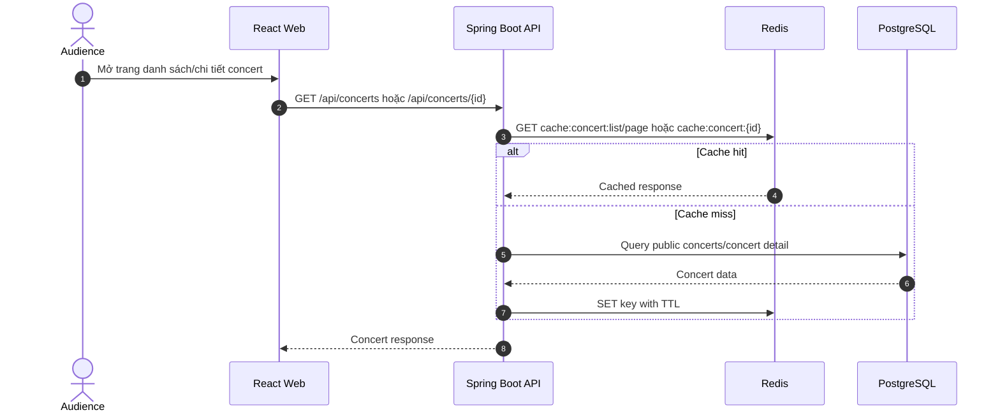
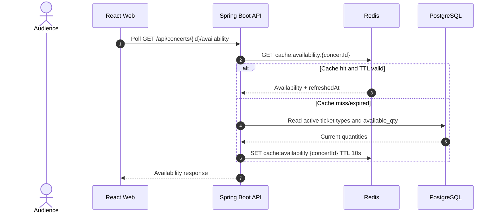

# Chiến lược caching concert và ticket availability

## 1. Mục tiêu

Tài liệu này mô tả chiến lược caching cho danh sách concert, chi tiết concert và số vé còn lại để TicketBox chịu được lượng đọc lớn trong giờ mở bán, nhưng vẫn đảm bảo dữ liệu giao dịch đúng khi giữ vé/mua vé.

Nguyên tắc thiết kế:

- Redis dùng để giảm tải đọc và làm read model gần thời gian thực.
- PostgreSQL vẫn là nguồn dữ liệu đúng cuối cùng cho concert, ticket type, order và inventory.
- Cache không được là cơ chế quyết định bán vé cuối cùng; mọi reserve/order vẫn phải kiểm tra và cập nhật tồn kho bằng transaction/atomic update trong PostgreSQL.
- Dữ liệu càng dễ thay đổi thì TTL càng ngắn và cần invalidation rõ ràng.

## 2. Dữ liệu được cache

| Dữ liệu | Endpoint | Lý do cache | Độ nhạy nhất quán |
|---|---|---|---|
| Danh sách concert public | `GET /api/concerts?page=&size=` | Trang chủ/danh sách bị đọc rất nhiều, dữ liệu ít đổi hơn inventory | Trung bình; admin sửa/hủy concert cần invalidate |
| Chi tiết concert public | `GET /api/concerts/{concertId}` | Trang chi tiết có poster, artist bio, seat map, ticket type public | Trung bình; sửa concert/ticket type/artist bio cần invalidate |
| Số vé còn lại theo ticket type | `GET /api/concerts/{concertId}/availability` | Người dùng poll liên tục trong lúc chọn vé | Cao; TTL ngắn, nên invalidate khi ticket type hoặc tồn kho thay đổi |

## 3. Cache-aside pattern

TicketBox dùng cache-aside:

1. API nhận request đọc dữ liệu public.
2. Backend tạo cache key từ endpoint và tham số quan trọng.
3. Backend đọc Redis trước.
4. Nếu cache hit, trả dữ liệu từ Redis.
5. Nếu cache miss hoặc dữ liệu cache parse lỗi, backend đọc PostgreSQL.
6. Backend ghi kết quả vào Redis với TTL phù hợp.
7. Response trả cho client theo format API thống nhất.

Khi Redis lỗi, API đọc PostgreSQL trực tiếp và trả response bình thường nếu DB vẫn khỏe. Lỗi cache không được làm hỏng luồng xem concert.

## 4. Key format và TTL

Các key hiện tại được định nghĩa theo convention trong `RedisKeyConstants`:

| Mục cache | Key format | TTL đề xuất/hiện tại | Ghi chú |
|---|---|---:|---|
| Concert list | `cache:concert:list:page:{page}:size:{size}` | 60 giây | Có thể mở rộng thêm filter/sort vào key nếu API có nhiều filter public. |
| Concert detail | `cache:concert:{concertId}` | 120 giây | Chứa thông tin public-facing của concert và ticket types active. |
| Availability | `cache:availability:{concertId}` | 10 giây | TTL ngắn vì `availableQty` thay đổi khi giữ vé, tạo order, hết hạn hold hoặc release. |

TTL 60/120 giây phù hợp với concert list/detail vì các trường như tên sự kiện, địa điểm, poster, artist bio không thay đổi liên tục trong giờ cao điểm. TTL 10 giây cho availability giúp giảm tải polling nhưng vẫn giới hạn độ lệch hiển thị.

## 5. Invalidation rules

| Sự kiện thay đổi | Key cần xóa | Lý do |
|---|---|---|
| Admin/Organizer tạo concert mới | `cache:concert:list:page:*` | Concert mới có thể xuất hiện trong danh sách public khi được publish. |
| Sửa thông tin concert | `cache:concert:{concertId}`, `cache:concert:list:page:*` | Tên, thời gian, địa điểm, trạng thái, poster hoặc visibility có thể đổi. |
| Đổi trạng thái concert | `cache:concert:{concertId}`, `cache:concert:list:page:*` | Concert có thể chuyển `ON_SALE`, `SOLD_OUT`, `CANCELLED`, `COMPLETED`. |
| Xóa concert draft | `cache:concert:{concertId}`, `cache:concert:list:page:*` | Loại bỏ dữ liệu cũ khỏi các trang danh sách. |
| Cập nhật poster/artist bio | `cache:concert:{concertId}`, `cache:concert:list:page:*` | Chi tiết concert public thay đổi. |
| Tạo/sửa/bật/tắt/xóa ticket type | `cache:concert:{concertId}`, `cache:availability:{concertId}`, `cache:concert:list:page:*` | Ticket type ảnh hưởng cả detail, availability và đôi khi summary. |
| Reserve/hold vé | `cache:availability:{concertId}` hoặc chờ TTL 10s | Số vé còn lại giảm; nên evict ngay nếu muốn UX sát hơn. |
| Release hold/hết hạn order chờ thanh toán | `cache:availability:{concertId}` hoặc chờ TTL 10s | Số vé còn lại tăng lại. |
| Payment thành công sinh ticket | `cache:availability:{concertId}` nếu order trước đó chưa trừ inventory ở bước hold | Đảm bảo số vé còn lại phản ánh trạng thái cuối. |

Trong code hiện tại, concert/ticket type mutation đã evict list/detail/availability liên quan. Với inventory thay đổi rất thường xuyên, TTL ngắn 10 giây là lớp bảo vệ tối thiểu; nếu cần độ tươi cao hơn trong demo rush-sale, service reserve/order/expiration nên chủ động xóa `cache:availability:{concertId}` sau khi transaction commit.

## 6. Tính nhất quán dữ liệu

### 6.1 Nguồn dữ liệu đúng

`ticket_types.available_qty` trong PostgreSQL là nguồn đúng cho tồn kho. Khi giữ vé hoặc tạo order, backend phải dùng atomic update có điều kiện:

```sql
UPDATE ticket_types
SET available_qty = available_qty - :quantity
WHERE id = :ticketTypeId
  AND available_qty >= :quantity;
```

Nếu số row update là 0, request không được giữ/mua vé vì không đủ tồn kho. Cách này chống oversell ngay cả khi Redis cache đang cũ.

### 6.2 Độ lệch chấp nhận được khi hiển thị

Availability trên UI là thông tin gần thời gian thực, không phải cam kết giữ vé. Trong rush sale, người dùng có thể thấy còn vé trong vài giây nhưng khi bấm giữ vé thì backend vẫn có quyền trả lỗi hết vé nếu DB đã hết.

Để tránh hiển thị sai quá lâu:

- TTL `cache:availability:{concertId}` đặt ngắn, hiện tại 10 giây.
- Frontend poll availability mỗi 3-5 giây trong màn chọn vé.
- Sau thao tác reserve/release/order thành công, frontend nên refetch availability ngay.
- Backend nên evict availability cache sau các mutation inventory quan trọng.
- Response availability có `refreshedAt` để UI/QA biết dữ liệu được làm mới lúc nào.

### 6.3 Cache stampede

Concert list/detail có thể bị miss cùng lúc khi TTL hết. Với scope đồ án, TTL ngắn và query nhẹ có thể chấp nhận. Nếu cần hardening thêm:

- dùng lock ngắn `cache:lock:{key}` khi rebuild cache;
- thêm jitter TTL để các page không hết hạn cùng lúc;
- prewarm cache cho concert hot trước giờ mở bán;
- giới hạn page size public để tránh cache object quá lớn.

## 7. Luồng đọc concert list/detail



## 8. Luồng đọc availability



## 9. Failure boundary

| Thành phần lỗi | Ảnh hưởng | Cách xử lý |
|---|---|---|
| Redis unavailable | Cache miss toàn bộ, DB chịu tải đọc cao hơn; rate limit/idempotency/queue cũng suy giảm | Đọc PostgreSQL trực tiếp cho concert; cảnh báo vận hành; rush-sale cần khôi phục Redis nhanh. |
| Cache stale | UI có thể hiển thị số vé còn lại lệch vài giây | DB vẫn chặn oversell; TTL ngắn, polling và evict sau mutation giúp giảm lệch. |
| Eviction thất bại | Dữ liệu cũ tồn tại tới khi TTL hết | Không rollback mutation nghiệp vụ; ghi log/cảnh báo nếu lỗi lặp lại. |
| PostgreSQL unavailable | Không rebuild cache khi miss; dữ liệu giao dịch không thể xác nhận | Có thể trả cached data ngắn hạn cho concert public nếu còn trong Redis, nhưng không cho reserve/order mới. |

## 10. Tài liệu và thành phần liên quan

- `blueprint/design.md`: Technology Stack/Redis, luồng public concert browsing, failure boundary Redis.
- `backend/src/main/java/com/ticketbox/shared/util/RedisKeyConstants.java`: key format và TTL.
- `backend/src/main/java/com/ticketbox/module/concert/application/ConcertService.java`: cache-aside cho concert list/detail và evict khi concert đổi.
- `backend/src/main/java/com/ticketbox/module/concert/application/TicketTypeService.java`: cache-aside availability và evict khi ticket type đổi.
- `docs/api/api-endpoints.md`: endpoint `/concerts`, `/concerts/{id}`, `/concerts/{id}/availability`.

## 11. Tiêu chí nghiệm thu

| Kịch bản |
|---|
| Gọi `GET /api/concerts` lần đầu đọc DB và ghi Redis key `cache:concert:list:page:{page}:size:{size}` với TTL 60 giây. |
| Gọi lại cùng page trước khi TTL hết trả dữ liệu từ cache. |
| Gọi `GET /api/concerts/{id}` tạo key `cache:concert:{concertId}` với TTL 120 giây. |
| Gọi `GET /api/concerts/{id}/availability` tạo key `cache:availability:{concertId}` với TTL 10 giây và có `refreshedAt`. |
| Sửa concert hoặc ticket type sẽ xóa cache detail/list/availability liên quan. |
| Khi Redis lỗi, API concert vẫn có thể đọc PostgreSQL trực tiếp; lỗi cache không làm sập luồng xem concert. |
| Khi cache availability cũ, reserve/order vẫn dựa vào atomic update PostgreSQL nên không oversell. |
