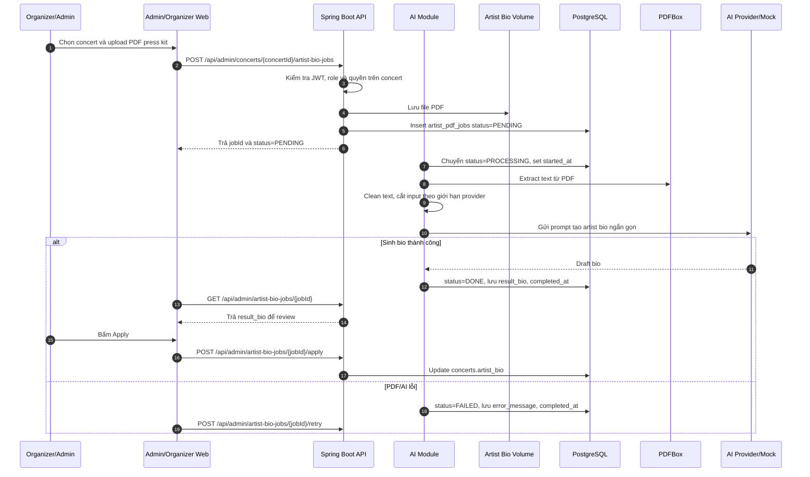
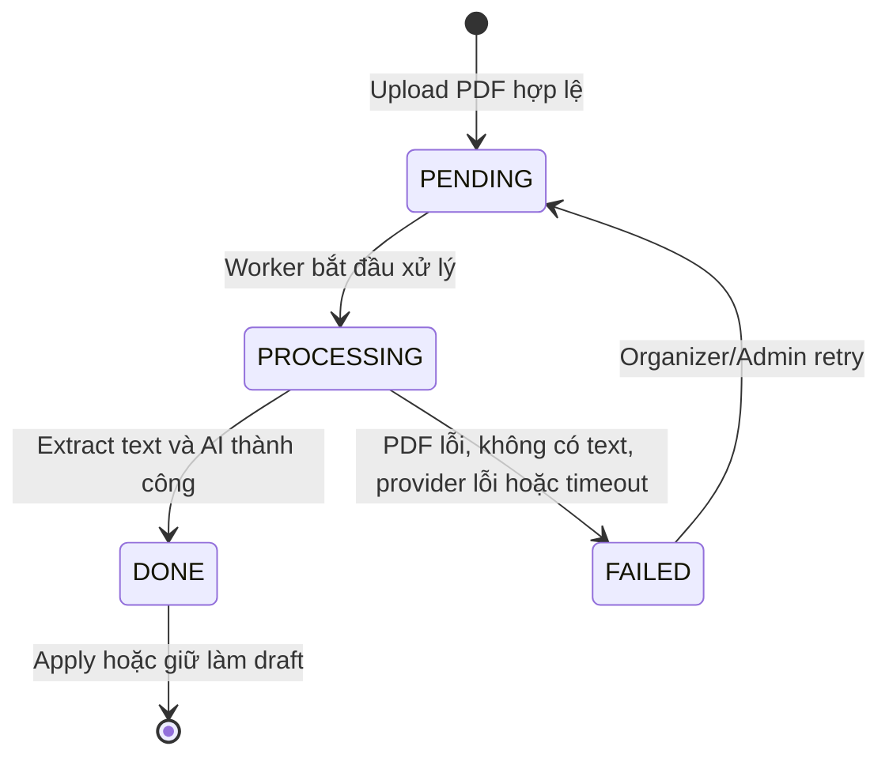

# Đặc tả: AI Artist Bio

Tài liệu này mô tả chức năng tạo bản giới thiệu nghệ sĩ bằng AI từ file PDF hồ sơ nghệ sĩ hoặc press kit do Ban tổ chức upload. Đây là luồng hỗ trợ vận hành nội dung concert, không nằm trên critical path của xem concert, mua vé, thanh toán hoặc soát vé.

---

## 1. Mô tả

Ban tổ chức hoặc Admin có thể upload một file PDF dạng text-based cho một concert. Hệ thống lưu file, tạo job xử lý, tách nội dung bằng PDFBox, làm sạch văn bản, gửi prompt sang AI provider tương thích OpenAI/Gemini hoặc mock provider trong môi trường local, sau đó lưu kết quả thành bản nháp `result_bio`.

Kết quả AI không tự động ghi đè thông tin concert. Organizer/Admin phải xem lại bản nháp và bấm apply thì hệ thống mới cập nhật `concerts.artist_bio`. Cách này tránh việc nội dung AI chưa kiểm duyệt hiển thị ngay trên trang public.

---

## 2. Thành phần tham gia

| Thành phần | Trách nhiệm |
|---|---|
| Organizer/Admin Web | Upload PDF, xem trạng thái job, review bio draft, apply hoặc retry. |
| Spring Boot API | Kiểm tra quyền, nhận multipart upload, tạo job, trả trạng thái job. |
| AI Module | Điều phối pipeline extract text, clean text, gọi AI provider và cập nhật trạng thái. |
| Artist Bio Volume/File Store | Lưu file PDF đã upload và metadata đường dẫn file. |
| PDFBox | Tách text từ PDF text-based. |
| AI Provider Adapter | Gọi provider thật hoặc mock provider theo cấu hình. |
| PostgreSQL | Lưu `artist_pdf_jobs` và cập nhật `concerts.artist_bio` khi apply. |

---

## 3. API và phân quyền

| Method | Endpoint | Role | Mục đích |
|---|---|---|---|
| `POST` | `/api/admin/concerts/{concertId}/artist-bio-jobs` | `ORGANIZER`, `ADMIN` | Upload PDF và tạo job xử lý bất đồng bộ. |
| `GET` | `/api/admin/artist-bio-jobs/{jobId}` | `ORGANIZER`, `ADMIN` | Xem trạng thái, lỗi hoặc kết quả `result_bio`. |
| `POST` | `/api/admin/artist-bio-jobs/{jobId}/apply?overwrite=false` | `ORGANIZER`, `ADMIN` | Apply kết quả đã hoàn thành vào `concerts.artist_bio`. |
| `POST` | `/api/admin/artist-bio-jobs/{jobId}/retry` | `ORGANIZER`, `ADMIN` | Chạy lại job đã thất bại. |

Organizer chỉ được thao tác trên concert thuộc phạm vi quản lý của mình. Admin được thao tác toàn hệ thống. Audience và Staff không được gọi các endpoint này.

---

## 4. Luồng chính

---

## 5. Trạng thái dữ liệu

### 5.1 Job state

### 5.2 Entity chính

| Entity | Trường quan trọng | Ghi chú |
|---|---|---|
| `artist_pdf_jobs` | `id`, `concert_id`, `file_url`, `status`, `result_bio`, `error_message`, `started_at`, `completed_at` | Lưu trạng thái xử lý AI và kết quả draft. |
| `concerts` | `artist_bio` | Chỉ cập nhật khi Organizer/Admin apply job `DONE`. |

---

## 6. Kịch bản lỗi và xử lý

| Tình huống lỗi | Cách xử lý | Ảnh hưởng |
|---|---|---|
| File không phải PDF | Từ chối upload với lỗi validation rõ ràng. | Không tạo job. |
| File vượt giới hạn kích thước hoặc số trang | Từ chối upload hoặc đánh dấu job `FAILED` tùy thời điểm phát hiện. | Không ảnh hưởng concert hiện có. |
| PDF scan ảnh, rỗng hoặc không tách được text | Job chuyển `FAILED`, lưu `error_message`. | Organizer có thể upload file khác hoặc retry sau khi sửa file. |
| AI provider timeout/lỗi/rate limit | Circuit breaker `artistBioAi` ngắt nhanh khi lỗi liên tục; job `FAILED`. | Không chặn concert CRUD, mua vé, payment, CSV import, check-in. |
| Không cấu hình API key trong local/dev và provider=`auto` | Dùng deterministic mock provider để demo ổn định. | Vẫn có bio draft để kiểm thử end-to-end. |
| Provider thật đã được cấu hình nhưng lỗi | Không âm thầm fallback sang mock; job `FAILED` để tránh kết quả không đúng kỳ vọng vận hành. | Có thể retry khi provider phục hồi. |
| Apply khi job chưa `DONE` | Trả lỗi nghiệp vụ, không cập nhật `concerts.artist_bio`. | Dữ liệu public không đổi. |
| Concert đã có `artist_bio` và `overwrite=false` | Từ chối ghi đè, yêu cầu `overwrite=true`. | Tránh mất nội dung đã kiểm duyệt. |

---

## 7. Ràng buộc

- Upload dùng `multipart/form-data`, part name là `file`.
- Chỉ hỗ trợ PDF text-based; OCR cho PDF scan ảnh nằm ngoài phạm vi.
- Kích thước mặc định tối đa: 10 MB.
- Số trang mặc định tối đa: 50 trang.
- API key của AI provider lấy từ biến môi trường, không commit vào source code.
- Cấu hình provider dùng `ARTIST_BIO_AI_PROVIDER` và `ARTIST_BIO_AI_API_KEY`.
- Pipeline chạy bất đồng bộ, client poll job bằng `GET /api/admin/artist-bio-jobs/{jobId}`.
- Nội dung AI là draft, phải được Organizer/Admin review và apply thủ công.
- Lỗi AI/PDF không được rollback hoặc làm gián đoạn các nghiệp vụ chính như mua vé, thanh toán, check-in và import CSV.

---

## 8. Tài liệu liên quan

| Tài liệu | Nội dung liên quan |
|---|---|
| `blueprint/design.md` | Kiến trúc tổng thể, AI module, high-level AI flow và failure boundary. |
| `blueprint/data-model/erd.md` | Entity `artist_pdf_jobs` và quan hệ với `concerts`. |
| `blueprint/specs/auth.md` | RBAC cho Organizer/Admin. |
| `blueprint/specs/circuit-breaker.md` | Circuit breaker `artistBioAi` và graceful degradation khi AI lỗi. |
| `docs/api/api-endpoints.md` | Endpoint, upload format và job behavior. |

---

## 9. Tiêu chí nghiệm thu

| Tiêu chí |
|---|
| Organizer/Admin upload PDF text-based hợp lệ và nhận được `jobId` với trạng thái ban đầu `PENDING`. |
| Job chuyển `PENDING -> PROCESSING -> DONE` và lưu `result_bio` khi extract text và AI provider thành công. |
| Organizer/Admin xem được draft bio, bấm apply và `concerts.artist_bio` được cập nhật. |
| Trang chi tiết concert public hiển thị artist bio mới sau khi apply. |
| File không phải PDF, PDF rỗng hoặc PDF scan không có text bị từ chối hoặc tạo job `FAILED` kèm lỗi rõ ràng. |
| Khi AI provider lỗi, job `FAILED`, có thể retry và các luồng mua vé/payment/check-in/CSV vẫn hoạt động. |
| Trong local/dev, nếu provider=`auto` và không có API key, mock provider tạo được bio draft để demo. |
| Khi dùng provider thật đã cấu hình, lỗi provider không được âm thầm fallback sang mock. |
| Apply job chưa `DONE` hoặc ghi đè bio khi `overwrite=false` bị từ chối. |
