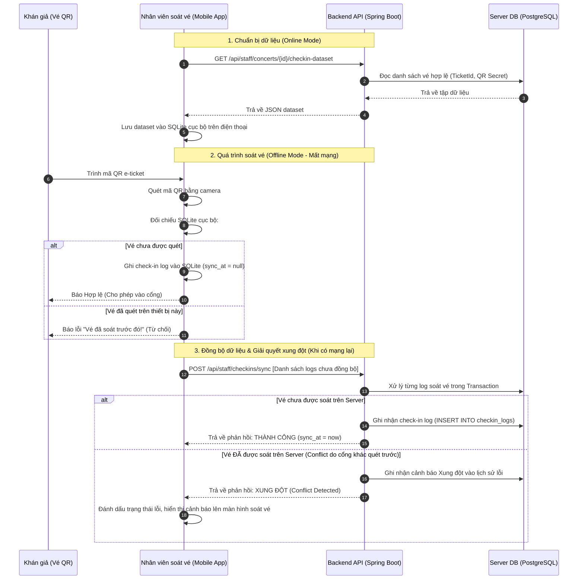
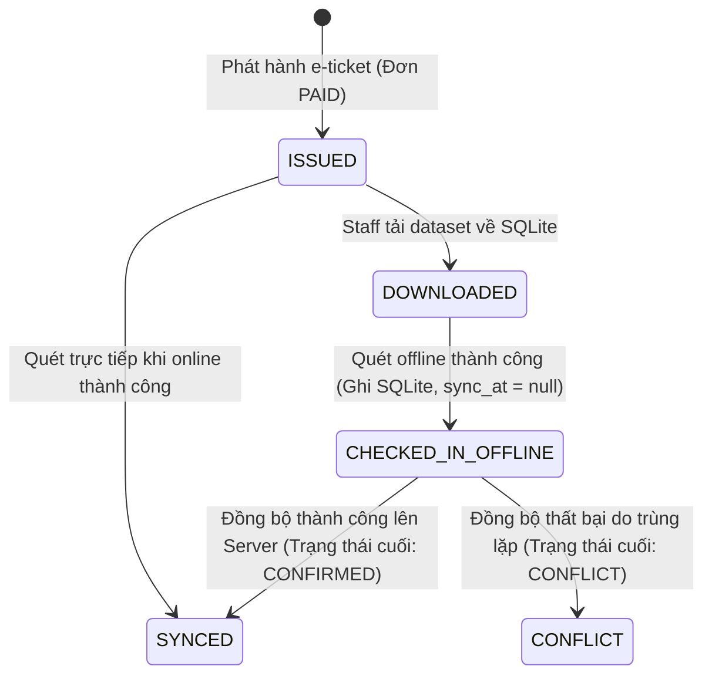

# Đặc tả: Offline Gate Check-In & Synchronization (BP07)

Tính năng này cho phép nhân viên soát vé (Staff) thực hiện kiểm tra vé trực tuyến và ngoại tuyến (offline) thông qua ứng dụng di động Expo tại các địa điểm tổ chức sự kiện có sóng di động yếu hoặc không ổn định. Hệ thống đảm bảo tính toàn vẹn của dữ liệu soát vé và ngăn chặn tuyệt đối một vé được sử dụng để vào cổng nhiều lần.

---

## 1. Mô tả
Trong các sự kiện thực tế, kết nối internet tại cổng sân vận động thường rất yếu hoặc chập chờn. Luồng soát vé ngoại tuyến cho phép thiết bị di động của nhân viên soát vé tự tải trước cơ sở dữ liệu vé hợp lệ về bộ nhớ máy (SQLite), kiểm tra vé cục bộ mà không cần mạng, ghi nhận lịch sử quét và tự động đồng bộ lên máy chủ chính khi khôi phục kết nối.

---

## 2. Luồng chính & Sơ đồ trình tự

---

## 3. Sơ đồ chuyển trạng thái Vé (State Diagram)

Sơ đồ dưới đây biểu diễn trạng thái của chiếc vé từ lúc phát hành đến khi được quét và đồng bộ thành công:

---

## 4. Cơ chế giải quyết xung đột (Conflict Handling)

Xung đột (Conflict) xảy ra khi **2 thiết bị soát vé khác nhau ở 2 cổng khác nhau quét cùng một chiếc vé khi đang offline**, dẫn đến việc cả hai thiết bị đều báo thành công tại chỗ. Khi có mạng trở lại và đồng bộ dữ liệu, hệ thống xử lý như sau:

1. **Nguyên tắc "Đến trước ghi trước" (First-Write-Wins):**
   * Khi server xử lý lô dữ liệu đồng bộ (`POST /api/staff/checkins/sync`), yêu cầu ghi nhận của thiết bị nào được gửi lên server và thực thi trước sẽ được ghi nhận là **Hợp lệ (CONFIRMED)**. 
   * Trạng thái vé được lưu trữ trong bảng `checkin_logs` trên PostgreSQL.
2. **Xử lý bản ghi đến sau (Conflict Resolution):**
   * Thiết bị đồng bộ sau gửi log quét của cùng một `ticketId` lên server.
   * Lớp xử lý nghiệp vụ của Server kiểm tra bảng `checkin_logs` toàn cục và thấy vé này đã có lịch sử soát vé thành công từ trước.
   * Server sẽ **từ chối bản ghi thứ hai**, trả về phản hồi lỗi hoặc cảnh báo Xung đột (`status = CONFLICT`) cho điện thoại thứ hai.
   * Server lưu thông tin lỗi này vào nhật ký kiểm soát (`conflict_logs`) để phục vụ kiểm toán sau sự kiện.
3. **Phản hồi phía thiết bị di động:**
   * Thiết bị di động nhận kết quả `CONFLICT` từ Server sẽ chuyển trạng thái của log đó trong SQLite sang `CONFLICT`, hiển thị cảnh báo đỏ nổi bật trên màn hình kiểm soát của Staff kèm thời gian quét trùng lặp để nhân viên phát hiện hành vi gian lận (một vé chia sẻ cho nhiều người vào cổng).

---

## 5. Ràng buộc kỹ thuật
* **Ràng buộc Database Server (PostgreSQL):**
  * Cột `ticket_id` trong bảng `checkin_logs` trên Server có ràng buộc **`UNIQUE`** để đảm bảo tuyệt đối không có lỗi logic phần mềm nào ghi đè được quy tắc soát vé một lần ở tầng Database.
* **SQLite cục bộ:**
  * Dữ liệu check-in logs được lưu trữ an toàn trong SQLite trên điện thoại thông minh của nhân viên bằng cơ chế transaction cục bộ, đảm bảo không bị mất log khi app bị tắt đột ngột hoặc điện thoại hết pin giữa chừng.

---

## 6. Tiêu chí nghiệm thu (Acceptance Criteria)
1. Staff tải xuống toàn bộ tập dữ liệu soát vé của concert thành công khi có kết nối mạng.
2. Khi mất mạng hoàn toàn, ứng dụng di động vẫn cho phép quét mã QR, đối chiếu chữ ký/QR secret cục bộ và báo lỗi chính xác nếu QR giả hoặc sai concert.
3. Khi khôi phục mạng, hệ thống đồng bộ logs thành công lên Server và giải quyết xung đột (conflict) một cách minh bạch, ghi nhận chi tiết lỗi nếu có.
