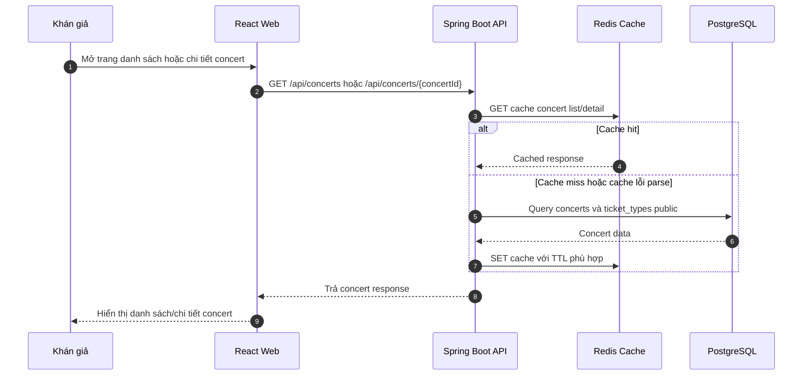
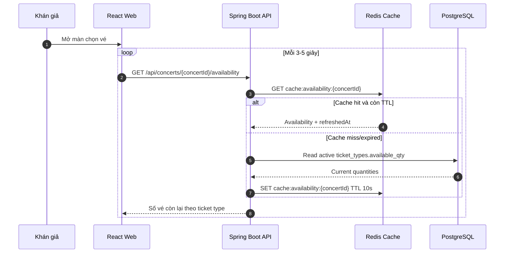

# Đặc tả: Concert Catalog & Availability Caching

Tài liệu này mô tả chức năng xem danh sách concert, xem chi tiết concert, sơ đồ chỗ ngồi/khu vé, loại vé và số vé còn lại gần thời gian thực. Đây là luồng đọc có tần suất rất cao trong giờ mở bán, nên cần cache để giảm tải PostgreSQL nhưng vẫn không được dùng cache làm nguồn quyết định bán vé cuối cùng.

---

## 1. Mô tả

Khán giả có thể xem danh sách concert công khai, mở trang chi tiết concert, xem thông tin nghệ sĩ, địa điểm, thời gian diễn ra, poster, `artist_bio`, seat map SVG và các khu vé như `GA`, `SVIP`, `VIP`, `CAT1`, `CAT2`.

Trong màn chọn vé, frontend hiển thị số vé còn lại theo từng ticket type. Giá trị này là dữ liệu gần thời gian thực để hỗ trợ trải nghiệm người dùng, không phải cam kết giữ vé. Khi người dùng reserve/order, backend vẫn phải kiểm tra tồn kho thật bằng PostgreSQL transaction/atomic update.

---

## 2. API và phân quyền

| Method | Endpoint | Role | Mục đích |
|---|---|---|---|
| `GET` | `/api/concerts` | `PUBLIC` | Xem danh sách concert public, hỗ trợ pagination/filter/sort. |
| `GET` | `/api/concerts/{concertId}` | `PUBLIC` | Xem chi tiết concert. |
| `GET` | `/api/concerts/{concertId}/seat-map` | `PUBLIC` | Lấy riêng seat map SVG cho concert. |
| `GET` | `/api/concerts/{concertId}/ticket-types` | `PUBLIC` | Lấy các ticket type/khu vé đang active. |
| `GET` | `/api/concerts/{concertId}/availability` | `PUBLIC` | Lấy số vé còn lại gần thời gian thực theo ticket type. |

Các API public chỉ trả concert phù hợp để hiển thị công khai, ví dụ `ON_SALE`, `SOLD_OUT` hoặc upcoming published concert. Concert `DRAFT`, concert bị ẩn hoặc dữ liệu thuộc phạm vi vận hành nội bộ không được lộ ra public catalog.

---

## 3. Thành phần tham gia

| Thành phần | Trách nhiệm |
|---|---|
| React Web App | Hiển thị catalog, detail, seat map, ticket type và polling availability. |
| Spring Boot API | Xử lý request public, áp dụng cache-aside, chuẩn hóa response. |
| Concert Module | Truy vấn concert, ticket type, seat map và artist bio. |
| Redis | Cache concert list/detail và availability. |
| PostgreSQL | Nguồn dữ liệu đúng cuối cùng cho concert, ticket type và inventory. |
| Organizer/Admin Module | Tạo/sửa/hủy/publish concert và kích hoạt invalidation cache. |

---

## 4. Luồng xem danh sách và chi tiết concert



Danh sách concert nên có pagination để tránh response quá lớn. Mặc định có thể dùng `page=0`, `size=10` hoặc `size=20`, sắp xếp theo `eventDate` tăng dần. Detail response có thể bao gồm `artist_bio`, poster, venue, event time, seat map summary và ticket type public.

---

## 5. Luồng availability gần thời gian thực



Frontend dùng polling 3-5 giây thay vì giữ WebSocket liên tục cho toàn bộ người xem. Lựa chọn này dễ scale hơn trong bối cảnh hàng chục nghìn người cùng xem trang mở bán, đồng thời tận dụng được Redis cache và HTTP stateless.

---

## 6. Chiến lược cache

TicketBox dùng cache-aside:

1. Backend nhận request đọc dữ liệu public.
2. Backend tạo cache key từ endpoint và tham số quan trọng.
3. Đọc Redis trước.
4. Nếu cache hit, trả dữ liệu từ Redis.
5. Nếu cache miss, cache lỗi hoặc Redis unavailable, đọc PostgreSQL.
6. Nếu đọc DB thành công và Redis khỏe, ghi response vào Redis với TTL phù hợp.

| Dữ liệu | Key format | TTL | Ghi chú |
|---|---|---:|---|
| Concert list | `cache:concert:list:page:{page}:size:{size}` | 60 giây | Có thể thêm filter/sort vào key nếu API mở rộng. |
| Concert detail | `cache:concert:{concertId}` | 120 giây | Chứa dữ liệu public-facing như poster, artist bio, seat map, ticket types. |
| Availability | `cache:availability:{concertId}` | 10 giây | TTL ngắn vì `available_qty` thay đổi khi reserve/order/release/expire. |

Cache không được quyết định việc bán vé. Reserve/order luôn dựa trên PostgreSQL và atomic update:

```sql
UPDATE ticket_types
SET available_qty = available_qty - :quantity
WHERE id = :ticketTypeId
  AND available_qty >= :quantity;
```

Nếu số row update là `0`, request bị từ chối vì không đủ vé, kể cả khi UI vừa hiển thị còn vé do cache cũ.

---

## 7. Invalidation

| Sự kiện thay đổi | Cache cần xóa | Lý do |
|---|---|---|
| Organizer/Admin tạo hoặc publish concert | `cache:concert:list:page:*` | Concert mới có thể xuất hiện trong danh sách public. |
| Sửa thông tin concert | `cache:concert:{concertId}`, `cache:concert:list:page:*` | Tên, thời gian, venue, poster, status hoặc visibility thay đổi. |
| Hủy/đổi trạng thái concert | `cache:concert:{concertId}`, `cache:concert:list:page:*` | Concert có thể không còn hiển thị hoặc đổi trạng thái. |
| Cập nhật `artist_bio` từ AI job | `cache:concert:{concertId}`, `cache:concert:list:page:*` | Nội dung public detail thay đổi. |
| Tạo/sửa/kích hoạt/tắt ticket type | `cache:concert:{concertId}`, `cache:availability:{concertId}`, `cache:concert:list:page:*` | Ticket type ảnh hưởng detail và availability. |
| Reserve/hold vé | `cache:availability:{concertId}` hoặc chờ TTL 10s | Số vé còn lại giảm. |
| Release hold hoặc order hết hạn | `cache:availability:{concertId}` hoặc chờ TTL 10s | Số vé còn lại tăng lại. |
| Payment/ticket issuance thay đổi inventory cuối | `cache:availability:{concertId}` | Đảm bảo availability phản ánh trạng thái mới. |

Với inventory thay đổi thường xuyên, TTL 10 giây là lớp bảo vệ tối thiểu. Nếu cần UX sát hơn trong demo rush-sale, service reserve/order/expiration nên evict `cache:availability:{concertId}` sau khi transaction commit.

---

## 8. Kịch bản lỗi và xử lý

| Tình huống lỗi | Cách xử lý | Ảnh hưởng |
|---|---|---|
| Concert không tồn tại hoặc không public | Trả `404 Not Found`. | Không lộ dữ liệu draft/private. |
| Concert bị `CANCELLED` | Không cho mua vé; public detail có thể hiển thị trạng thái hủy nếu policy cho phép. | Người dùng không đi tiếp checkout. |
| Redis unavailable | Đọc PostgreSQL trực tiếp, ghi log/cảnh báo. | Catalog vẫn hoạt động nếu DB khỏe, nhưng DB chịu tải cao hơn. |
| Cache stale | UI có thể lệch availability vài giây. | Reserve/order vẫn dựa vào DB nên không oversell. |
| Eviction thất bại | Dữ liệu cũ tồn tại tới khi TTL hết. | Không rollback mutation nghiệp vụ; cần log để vận hành kiểm tra. |
| PostgreSQL unavailable | Không rebuild được cache miss, không xác nhận dữ liệu giao dịch. | Có thể trả cache public ngắn hạn nếu còn, nhưng không cho reserve/order mới. |
| Seat map SVG lỗi hoặc rỗng | Trả lỗi validation ở admin khi cập nhật; public detail dùng fallback UI nếu cần. | Không ảnh hưởng payment/check-in. |

---

## 9. Ràng buộc

- Public catalog không yêu cầu đăng nhập.
- Chỉ concert public/published mới được trả về ở API public.
- Response list/detail phải có pagination hoặc giới hạn kích thước để tránh object quá lớn.
- Seat map SVG là dữ liệu hiển thị, cần được sanitize/kiểm soát khi Admin/Organizer nhập để tránh XSS.
- Availability response nên có `refreshedAt` để UI/QA biết dữ liệu được tính tại thời điểm nào.
- Frontend poll availability mỗi 3-5 giây trong màn chọn vé.
- Cache availability chỉ phục vụ hiển thị; mọi reserve/order phải kiểm tra PostgreSQL.
- Redis lỗi không được làm sập luồng xem concert.
- PostgreSQL là nguồn dữ liệu đúng cuối cùng cho concert, ticket type và inventory.

---

## 10. Tài liệu liên quan

| Tài liệu | Nội dung liên quan |
|---|---|
| `blueprint/design.md` | Luồng xem concert, caching/availability, ADR polling thay WebSocket. |
| `blueprint/performance/cache-strategy.md` | TTL, key format, invalidation, failure boundary cache. |
| `blueprint/data-model/erd.md` | Entity `concerts`, `ticket_types` và quan hệ tồn kho. |
| `blueprint/specs/ticket-purchase.md` | Atomic inventory control khi giữ/mua vé. |
| `blueprint/specs/queue.md` | Waiting room và rate limit khi mở bán tải cao. |
| `docs/api/api-endpoints.md` | API contract cho concert public, ticket type và availability. |

---

## 11. Tiêu chí nghiệm thu

| Tiêu chí |
|---|
| `GET /api/concerts` trả danh sách concert public có pagination và không yêu cầu đăng nhập. |
| `GET /api/concerts/{concertId}` trả detail gồm thông tin concert, venue, poster, artist bio, seat map/ticket type public. |
| `GET /api/concerts/{concertId}/seat-map` trả seat map SVG của concert hợp lệ. |
| `GET /api/concerts/{concertId}/ticket-types` chỉ trả ticket type active/public. |
| `GET /api/concerts/{concertId}/availability` trả số vé còn lại theo ticket type và có `refreshedAt`. |
| Gọi concert list lần đầu cache miss sẽ đọc DB và ghi Redis key `cache:concert:list:page:{page}:size:{size}` TTL 60 giây. |
| Gọi lại cùng page trước khi TTL hết trả dữ liệu từ cache. |
| Gọi concert detail tạo key `cache:concert:{concertId}` TTL 120 giây. |
| Gọi availability tạo key `cache:availability:{concertId}` TTL 10 giây. |
| Khi Organizer/Admin sửa concert, ticket type hoặc artist bio, cache liên quan được invalidate. |
| Khi Redis lỗi, catalog vẫn đọc PostgreSQL trực tiếp nếu DB khỏe. |
| Khi availability cache cũ, reserve/order vẫn dựa vào atomic update PostgreSQL nên không oversell. |
