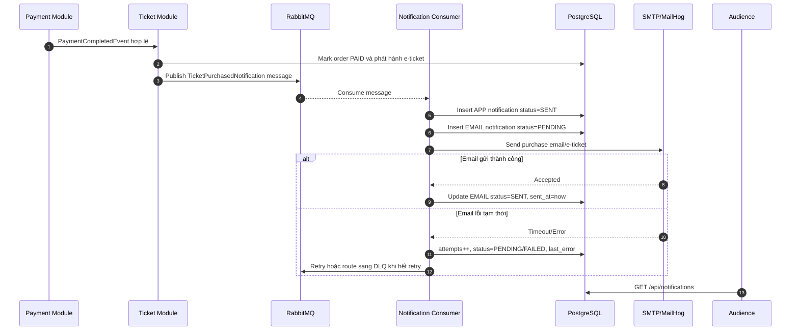
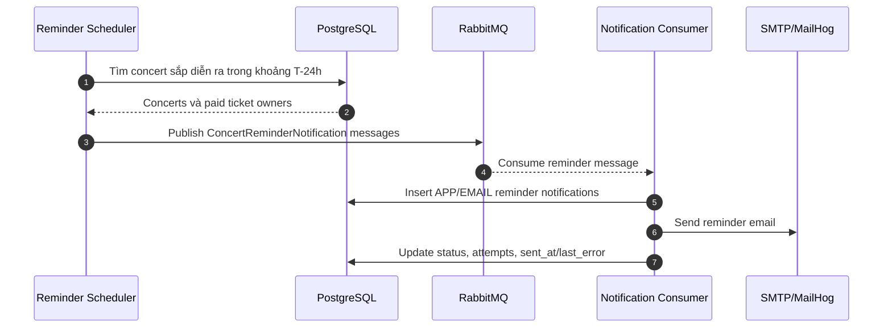
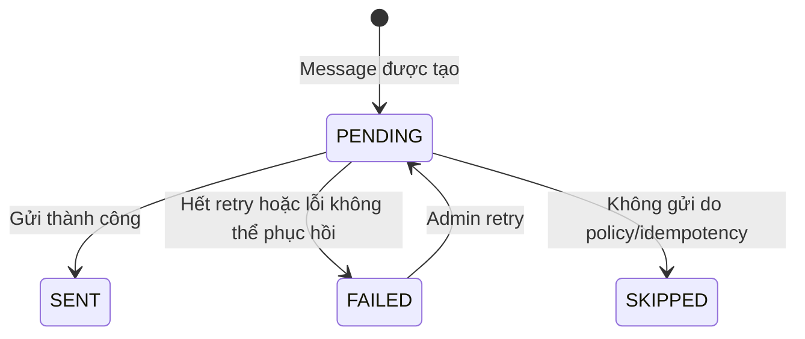

# Đặc tả: Notification

Tài liệu này mô tả cơ chế thông báo của TicketBox: thông báo trong app và email kèm e-ticket sau khi mua vé thành công, nhắc concert trước 24 giờ, và kiến trúc mở rộng để bổ sung kênh mới như Zalo OA hoặc SMS mà không phải sửa luồng nghiệp vụ chính.

Notification là tác vụ bất đồng bộ. Lỗi gửi email hoặc lỗi broker không được rollback order đã thanh toán, không được làm mất vé và không được chặn luồng mua vé.

---

## 1. Mô tả

Sau khi payment được xác nhận hợp lệ và e-ticket được phát hành, hệ thống tạo thông báo cho khán giả qua hai kênh mặc định:

- `APP`: lưu bản ghi trong bảng `notifications` để người dùng xem trong web/app.
- `EMAIL`: gửi email xác nhận mua vé kèm thông tin e-ticket/QR qua SMTP. Trong môi trường local, MailHog nhận email để kiểm tra.

Trước thời điểm concert diễn ra 24 giờ, scheduler tạo reminder cho các khán giả đã mua vé thành công. Reminder cũng đi qua cùng cơ chế notification để tái sử dụng retry, audit và channel abstraction.

---

## 2. Thành phần tham gia

| Thành phần | Trách nhiệm |
|---|---|
| Ticket/Payment Module | Phát event khi order đã `PAID` và ticket đã được phát hành. |
| Notification Module | Tạo notification, route theo channel, lưu trạng thái gửi và xử lý retry. |
| RabbitMQ | Broker cho notification message, retry và DLQ. |
| Notification Consumer | Consume message, gọi channel adapter tương ứng. |
| PostgreSQL | Lưu bảng `notifications`, trạng thái gửi, số lần retry và lỗi cuối. |
| SMTP/MailHog | Gửi email hoặc capture email trong local demo. |
| React Web App | Hiển thị notification list, unread count và mark as read. |
| Scheduler | Tạo concert reminder trước 24 giờ hoặc trigger thủ công bởi Admin. |

---

## 3. API và phân quyền

| Method | Endpoint | Role | Mục đích |
|---|---|---|---|
| `GET` | `/api/notifications` | `AUTHENTICATED` | Lấy danh sách notification của user hiện tại. |
| `GET` | `/api/notifications/unread-count` | `AUTHENTICATED` | Đếm notification chưa đọc của user hiện tại. |
| `PATCH` | `/api/notifications/{notificationId}/read` | `AUTHENTICATED` | Đánh dấu notification của chính user là đã đọc. |
| `GET` | `/api/admin/notifications` | `ADMIN` | Xem notification records phục vụ vận hành/debug. |
| `POST` | `/api/admin/notifications/{notificationId}/retry` | `ADMIN` | Retry notification đã lỗi. |
| `POST` | `/api/admin/concerts/{concertId}/reminders/send` | `ADMIN` | Trigger thủ công reminder cho một concert. |

Người dùng chỉ được xem và đánh dấu đã đọc notification của chính mình. Admin có thể xem trạng thái gửi toàn hệ thống để hỗ trợ vận hành.

---

## 4. Luồng thông báo sau mua vé



Order và ticket đã được commit trước khi notification gửi email. Vì vậy nếu SMTP chậm hoặc lỗi, khách hàng vẫn có vé trong tài khoản và có thể xem e-ticket trực tiếp trên web.

---

## 5. Luồng reminder trước 24 giờ



Để tránh gửi trùng reminder, message nên có key nghiệp vụ như `(event_type, user_id, concert_id, channel)` hoặc bảng `notifications` cần có logic idempotent lookup trước khi insert/gửi.

---

## 6. Thiết kế mở rộng kênh

Notification module dùng abstraction theo kênh:

```text
NotificationChannel
  - supports(channel)
  - send(message)
```

Các implementation ban đầu:

| Channel | Adapter | Ghi chú |
|---|---|---|
| `APP` | AppNotificationChannel | Lưu notification trong DB, hiển thị ở web/app. |
| `EMAIL` | EmailNotificationChannel | Gửi SMTP qua MailHog/local hoặc SMTP provider thật. |

Kênh tương lai:

| Channel | Adapter dự kiến | Cách mở rộng |
|---|---|---|
| `ZALO` | ZaloOaNotificationChannel | Thêm adapter mới, config token/API endpoint, không sửa payment/ticket flow. |
| `SMS` | SmsNotificationChannel | Thêm adapter mới, mapping template và provider config. |
| `PUSH` | PushNotificationChannel | Thêm adapter mới cho mobile push. |

Luồng nghiệp vụ chỉ publish event/message theo event type. Notification module quyết định channel nào cần gửi dựa trên cấu hình và preference, giúp tuân thủ Open/Closed Principle.

---

## 7. Dữ liệu và trạng thái

| Entity | Trường quan trọng | Ghi chú |
|---|---|---|
| `notifications` | `id`, `user_id`, `channel`, `event_type`, `subject`, `body`, `status`, `sent_at`, `attempts`, `last_error`, `created_at` | Lưu notification app/email và audit lỗi gửi. |

Trạng thái chính:



Event type ban đầu:

| Event type | Ý nghĩa |
|---|---|
| `TICKET_PURCHASED` | Xác nhận mua vé và e-ticket sau payment thành công. |
| `CONCERT_REMINDER` | Nhắc concert trước 24 giờ. |
| `CONCERT_CANCELLED` | Thông báo concert bị hủy nếu hệ thống mở rộng policy hủy vé. |

---

## 8. Kịch bản lỗi và xử lý

| Tình huống lỗi | Cách xử lý | Ảnh hưởng |
|---|---|---|
| RabbitMQ tạm thời lỗi khi publish | Ghi log/cảnh báo; tùy triển khai có thể dùng outbox hoặc retry publish sau. | Order/ticket đã thành công; email có thể chậm. |
| Consumer lỗi khi xử lý message | Message không ack, RabbitMQ retry theo policy. | Không ảnh hưởng payment. |
| SMTP/MailHog lỗi hoặc timeout | Tăng `attempts`, lưu `last_error`, retry; hết retry thì `FAILED` hoặc DLQ. | Khách vẫn xem e-ticket trong tài khoản. |
| Message trùng | Dùng idempotency theo event key hoặc kiểm tra notification đã tồn tại trước khi gửi. | Không gửi nhiều email/app notification cho cùng event. |
| User không còn active | Mark `SKIPPED` hoặc không gửi channel ngoài. | Không ảnh hưởng dữ liệu order/ticket. |
| Template render lỗi | Mark `FAILED`, lưu lỗi để Admin retry sau khi sửa template/config. | Không ảnh hưởng luồng chính. |
| Admin retry notification đã `SENT` | Từ chối hoặc yêu cầu action rõ ràng để tránh gửi trùng. | Bảo vệ người dùng khỏi spam. |

---

## 9. Ràng buộc

- Notification phải chạy bất đồng bộ, không block response thanh toán.
- Notification không được quyết định trạng thái order/ticket.
- APP notification phải được lưu để người dùng xem lại.
- EMAIL notification trong local/demo gửi qua MailHog (`SMTP 1025`, web UI `8025`).
- Mọi lỗi gửi phải có audit: `status`, `attempts`, `last_error`.
- Retry/DLQ dùng RabbitMQ để tránh mất message khi lỗi tạm thời.
- Endpoint `/api/notifications` chỉ trả dữ liệu của user hiện tại.
- Thêm channel mới không được yêu cầu sửa payment/ticket module.
- Không log thông tin nhạy cảm trong email payload, token hoặc credential SMTP/provider.

---

## 10. Tài liệu liên quan

| Tài liệu | Nội dung liên quan |
|---|---|
| `blueprint/design.md` | RabbitMQ, SMTP/MailHog, notification failure boundary. |
| `blueprint/adr.md` | ADR RabbitMQ vs Kafka. |
| `blueprint/specs/payment.md` | Payment success publish notification event. |
| `blueprint/specs/ticket-purchase.md` | Email lỗi không rollback order/ticket. |
| `blueprint/specs/auth.md` | RBAC cho notification endpoints. |
| `docs/api/api-endpoints.md` | Notification API contract. |
| `docs/database/schema.md` | Schema bảng `notifications`. |

---

## 11. Tiêu chí nghiệm thu

| Tiêu chí |
|---|
| Sau khi mua vé thành công, hệ thống tạo APP notification cho khán giả. |
| Sau khi mua vé thành công, hệ thống gửi email xác nhận/e-ticket và có thể kiểm tra trong MailHog. |
| Email/notification được xử lý qua RabbitMQ, không block luồng payment/order. |
| `GET /api/notifications` chỉ trả notification của user hiện tại. |
| `GET /api/notifications/unread-count` trả đúng số notification chưa đọc. |
| `PATCH /api/notifications/{id}/read` chỉ cho user sở hữu notification đánh dấu đã đọc. |
| Scheduler hoặc endpoint admin gửi được reminder cho concert trước 24 giờ. |
| Khi SMTP lỗi, notification được retry; hết retry thì chuyển `FAILED` hoặc DLQ, order/ticket vẫn thành công. |
| Message trùng không tạo/gửi notification trùng cho cùng event nghiệp vụ. |
| Có thể thêm channel mới như Zalo/SMS bằng adapter mới mà không sửa luồng payment/ticket hiện có. |
