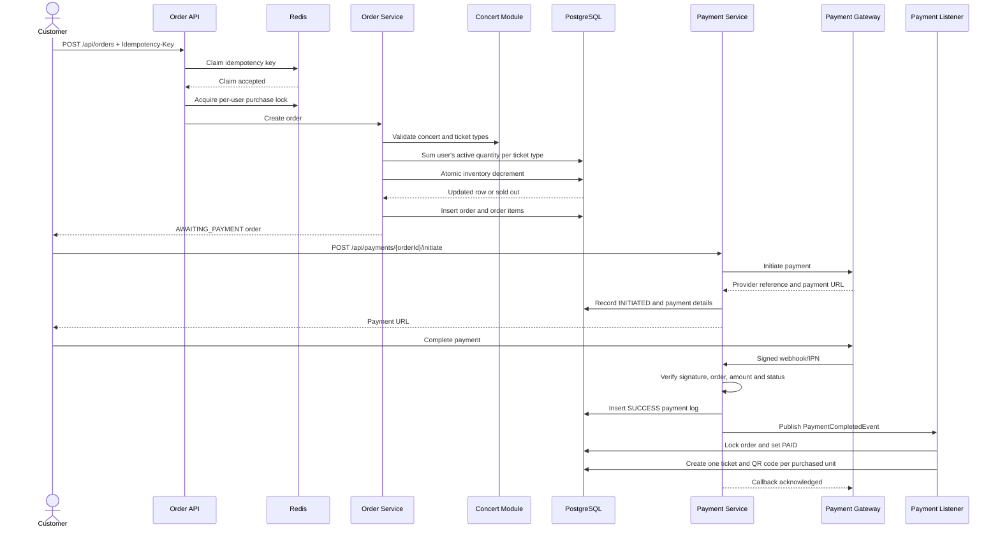

# TicketBox Payment Specification

## 1. Purpose

This document specifies how TicketBox creates an order, reserves ticket inventory, starts a payment, confirms the payment, and issues e-tickets.

The design must guarantee that:

- Ticket inventory is never oversold, including when many users buy concurrently.
- One account cannot exceed `max_per_account` by sending concurrent requests.
- Retried requests do not create duplicate orders or duplicate charges.
- Duplicate payment callbacks do not issue duplicate tickets.
- A payment-provider failure does not break concert browsing or other unrelated features.
- Inventory held by an unpaid order is eventually returned.

## 2. Participating Components

| Component | Responsibility |
|---|---|
| Audience web application | Sends order and payment requests and redirects the customer to the payment provider. |
| Order API | Authenticates the customer and accepts order creation requests. |
| Order service | Validates the purchase, enforces limits, reserves inventory, and creates the order. |
| Concert module | Supplies concert and ticket-type information and performs atomic inventory updates. |
| PostgreSQL | Stores orders, order items, ticket inventory, payment logs, and issued tickets. |
| Redis | Stores idempotency claims, per-user purchase locks, and rate-limit state. |
| Payment service | Initiates payments and validates payment callbacks. |
| Payment gateway adapter | Encapsulates provider-specific behavior such as VNPAY signing and verification. |
| Circuit breaker | Stops repeated calls to an unhealthy external payment provider. |
| Payment-completed listener | Marks the order as paid and creates tickets after successful payment. |
| Scheduler | Expires unpaid orders and releases their reserved inventory. |

## 3. Core Data and States

### 3.1 Order states

| State | Meaning |
|---|---|
| `AWAITING_PAYMENT` | Inventory is reserved and the customer may pay. |
| `PAID` | Payment was confirmed and tickets were issued. |
| `EXPIRED` | The payment window ended and reserved inventory was released. |
| `CANCELLED` | The order was cancelled. |
| `PAYMENT_FAILED` | A payment attempt failed. |
| `REFUNDED` | A completed payment was refunded. |

The main successful transition is:

```text
AWAITING_PAYMENT -> PAID
```

The main timeout transition is:

```text
AWAITING_PAYMENT -> EXPIRED
```

An order must never move from `EXPIRED`, `CANCELLED`, or `REFUNDED` to `PAID` without an explicit recovery process.

### 3.2 Payment log events

Payment activity is recorded using:

- `INITIATED`
- `WEBHOOK_RECEIVED`
- `SUCCESS`
- `FAILED`
- `TIMEOUT`
- `REFUNDED`

The database has a unique constraint on `(order_id, event_type)`. This is a final protection against recording the same result more than once.

### 3.3 Inventory meaning

`ticket_types.available_qty` represents inventory that is not currently held by an active order.

Inventory is reserved when the order is created, not when payment succeeds. This prevents several customers from being sent to payment for the same final ticket.

## 4. End-to-End Purchase Flow



## 5. Order Creation Under the Hood

### 5.1 Request

```http
POST /api/orders
Authorization: Bearer <audience-token>
Idempotency-Key: <unique-client-generated-value>
Content-Type: application/json
```

The authenticated user ID is taken from the security context. A client must not be allowed to choose another user's ID in the request body.

### 5.2 Idempotency claim

Before doing purchase work, the order service claims this Redis key:

```text
idempotency:order:{userId}:{clientKey}
```

The claim uses an atomic `SET if absent` operation.

- If the key is new, the request owns the claim and continues.
- If the key already exists, the request is rejected as a duplicate.
- After the database transaction commits, the Redis value is changed to `COMPLETED:{orderId}` and retained for the configured idempotency TTL.
- If the transaction rolls back, the temporary claim is released.

The database also stores the client idempotency key on the order. Redis provides fast coordination, while the database is the durable duplicate check.

The same key must not create a second order even if:

- The customer double-clicks the purchase button.
- The browser retries after a timeout.
- Two identical requests arrive simultaneously.

### 5.3 Per-user concurrency lock

TicketBox acquires a Redis lock using:

```text
lock:user:{userId}
```

This serializes order creation for the same account. It is required because `max_per_account` is calculated from existing active orders and would otherwise be vulnerable to a check-then-insert race.

Different users do not share this lock and may purchase concurrently.

The current implementation uses a five-second lock lease. Processing should finish before that lease expires. A production-hardened implementation should use lease renewal or a database-backed per-user/ticket-type reservation counter so a slow request cannot outlive its lock.

### 5.4 Business validation

The order service validates:

1. The concert exists.
2. The concert status is `ON_SALE`.
3. Every requested ticket type exists.
4. Every ticket type belongs to the requested concert.
5. Every ticket type is active.
6. The current time is inside its sale period.
7. The requested quantity is valid.
8. The account will not exceed `max_per_account`.
9. Sufficient inventory is available.

The whole order is transactional. If any item fails, the order and all inventory updates made in that transaction must roll back.

### 5.5 Enforcing `max_per_account`

For each requested ticket type, TicketBox calculates:

```text
already ordered in AWAITING_PAYMENT or PAID orders
+ quantity in the new request
<= ticket_type.max_per_account
```

`AWAITING_PAYMENT` is included because its inventory is already held. Ignoring it would allow one user to open many unpaid orders and reserve more than the configured limit.

Example:

```text
Maximum per account: 2
Existing active quantity: 1
New requested quantity: 2
Result: rejected because 1 + 2 > 2
```

### 5.6 Preventing overselling

Inventory is reserved with one conditional database statement:

```sql
UPDATE ticket_types
SET available_qty = available_qty - :quantity
WHERE id = :ticketTypeId
  AND available_qty >= :quantity;
```

The update succeeds only when enough inventory remains at the instant PostgreSQL executes it.

- One updated row means the reservation succeeded.
- Zero updated rows means the ticket type is sold out for that quantity.

This is safer than reading `available_qty`, checking it in Java, and updating later. Concurrent transactions compete on the database row, so only requests backed by real remaining inventory can succeed.

### 5.7 Persisting the order

After all checks and reservations succeed, TicketBox stores:

- An order with status `AWAITING_PAYMENT`.
- The authenticated user and concert IDs.
- The server-calculated total amount.
- The idempotency key.
- An expiration time 15 minutes in the future.
- One order item per requested ticket type.
- The unit price and subtotal captured at purchase time.

Prices must come from the server-side ticket type, never from a value supplied by the customer.

## 6. Payment Initiation Under the Hood

The customer starts payment using:

```http
POST /api/payments/{orderId}/initiate
```

The payment service:

1. Parses the requested provider; the local default is `MOCK`.
2. Loads the order.
3. Requires the order to be `AWAITING_PAYMENT`.
4. Returns the existing payment URL when the same provider was already initiated.
5. Resolves the correct provider adapter.
6. Creates a provider reference and payment URL.
7. Records an `INITIATED` payment log once.
8. Stores the provider, reference, and URL on the order.

Returning the existing URL makes repeated initiation calls safe and avoids starting unnecessary payment attempts for the same provider.

### 6.1 VNPAY initiation

The VNPAY adapter:

- Uses the order ID as `vnp_TxnRef`.
- Converts the amount to VNPAY's expected unit.
- Adds creation and 15-minute expiration timestamps.
- Sorts and URL-encodes the parameters.
- Signs the payload using HMAC-SHA512.
- Returns the generated sandbox payment URL.

The current adapter generates the redirect URL locally. It does not make a remote HTTP call during initiation. Therefore, the circuit breaker protects exceptions thrown by this operation, but it cannot detect a VNPAY network outage until the integration includes an actual outbound provider call or health-dependent operation.

## 7. Payment Confirmation Under the Hood

The browser return URL is only for customer experience. The trusted source for confirming payment is the signed server-to-server webhook/IPN.

For a VNPAY callback, TicketBox:

1. Requires `vnp_SecureHash`.
2. Removes signature-only fields from the signed data.
3. Rebuilds the canonical sorted payload.
4. Verifies the HMAC-SHA512 signature.
5. Parses `vnp_TxnRef` as the TicketBox order ID.
6. Converts and validates the paid amount.
7. Requires the order to exist.
8. Requires the amount to equal the server-side order total.
9. Rejects a result for an order that is no longer payable.
10. Records `SUCCESS` or `FAILED`.
11. Publishes `PaymentCompletedEvent` only for a valid successful result.

An invalid signature, unknown order, or mismatched amount must never mark an order as paid.

## 8. Ticket Issuing

The payment module does not directly create tickets. It publishes a payment-completed event, and the ticket module handles it.

The listener:

1. Loads the order using a pessimistic database write lock.
2. Returns without doing anything if the order is already `PAID`.
3. Requires the previous status to be `AWAITING_PAYMENT`.
4. Sets the order to `PAID`.
5. Stores payment provider, provider reference, and payment time.
6. Creates exactly one ticket for each purchased unit.
7. Generates a unique QR secret and signed QR payload for every ticket.

This module boundary keeps provider-specific payment logic separate from ticket issuance.

## 9. Circuit Breaker and Graceful Degradation

The VNPAY adapter is configured with a Resilience4j circuit breaker named `vnpay`.

Current thresholds:

- Sliding window: 5 calls
- Minimum calls before evaluation: 3
- Failure-rate threshold: 50%
- Open-state wait: 30 seconds
- Half-open trial calls: 2

### 9.1 Closed

Calls are allowed. Failures are measured in the sliding window.

### 9.2 Open

Calls fail fast with `PAYMENT_GATEWAY_UNAVAILABLE` rather than waiting repeatedly on an unhealthy provider.

### 9.3 Half-Open

After 30 seconds, two trial calls are allowed.

- Successful trials close the circuit.
- Continued failures open it again.

### 9.4 Degraded behavior

When the payment provider is unavailable:

- Payment initiation returns HTTP `503 Service Unavailable`.
- The order remains `AWAITING_PAYMENT` until it expires or the user retries.
- No payment-success event is published.
- Concert list, concert details, authentication, and other unrelated APIs remain available.
- The customer should see a retry-later message rather than an ambiguous success.

## 10. Special and Failure Cases

### 10.1 Two users compete for the final ticket

Both requests execute the conditional inventory decrement. PostgreSQL allows only one request to decrement from `1` to `0`. The other request updates zero rows and receives `TICKET_SOLD_OUT`.

### 10.2 One user sends concurrent orders to bypass the limit

The per-user Redis lock serializes the requests. The first committed order becomes visible to the next limit calculation, so the combined active quantity cannot exceed `max_per_account`.

### 10.3 Same idempotency key arrives twice

Only one request can claim the Redis key. The duplicate receives a conflict response and must not reserve inventory or create another order.

### 10.4 Different idempotency keys for the same user

These represent separate purchase attempts. They are still serialized by the per-user lock and remain subject to `max_per_account`.

### 10.5 Redis is unavailable

TicketBox fails closed with `REDIS_UNAVAILABLE` rather than accepting an order without idempotency and per-user concurrency protection. No inventory should be changed.

### 10.6 Order contains several ticket types and one is sold out

The order transaction rolls back. Reservations for earlier items in the same transaction must also roll back, so the customer never receives a partial order accidentally.

### 10.7 Customer retries payment initiation

If the order already has a payment URL for the same provider, TicketBox returns it. It does not create another `INITIATED` log.

### 10.8 Duplicate successful webhook

TicketBox checks the order status and existing `SUCCESS` log. The database unique constraint adds a final race-condition guard. The duplicate callback is acknowledged as already processed and must not create more tickets.

### 10.9 Success and failure callbacks arrive concurrently

Only a valid result for a payable order may drive the success flow. Payment-log uniqueness prevents duplicate event types, while the pessimistic order lock prevents duplicate transition and ticket creation.

The desired final rule is that a confirmed success is terminal and must not later be overwritten by a failure callback.

### 10.10 Callback signature is invalid

The callback is rejected with VNPAY response code `97`. No success log, order transition, or ticket creation occurs.

### 10.11 Callback amount differs from the order

The callback is rejected with response code `04`. This protects against tampered or incorrectly associated payment data.

### 10.12 Callback references an unknown order

TicketBox returns response code `01`. No local state changes.

### 10.13 Payment succeeds after the order expires

The normal success transition is rejected because an `EXPIRED` order is not payable.

This case requires an operational reconciliation policy because the provider may have captured money after TicketBox released inventory. Recommended handling:

- Record the late provider result for audit.
- Do not issue a ticket automatically.
- Trigger an automatic refund or manual reconciliation workflow.
- Notify the customer that payment is being reconciled.

The current code rejects the state transition but does not yet implement automatic refund/reconciliation.

### 10.14 Customer never completes payment

A scheduled job finds expired `AWAITING_PAYMENT` orders in batches. It returns each order item's quantity to inventory and marks the order `EXPIRED`.

The expiration operation should be idempotent: once the order is no longer `AWAITING_PAYMENT`, another scheduler run must not release its inventory again.

### 10.15 Application fails after provider success

If the provider retries its webhook, the handler can resume processing safely. Durable payment logs and idempotent order transition logic prevent duplicate ticket issuance.

For stronger delivery guarantees across a crash between database commit and event handling, the recommended production design is a transactional outbox or durable Spring Modulith event publication.

### 10.16 Notification service is unavailable

Payment and ticket issuance must remain successful. Notification delivery is asynchronous and may retry through RabbitMQ without rolling back the paid order.

### 10.17 Rate limit exceeded

Purchase and payment endpoints return HTTP `429 Too Many Requests`. Read-only concert endpoints remain usable. A rejected request must not reserve inventory or create payment state.

## 11. Transaction and Consistency Rules

- Order creation, order items, and all inventory reservations belong to one transaction.
- Payment success logging and publication must not occur for an invalid callback.
- The paid-order transition and ticket creation belong to one transaction.
- Inventory release and the `EXPIRED` transition belong to one transaction.
- External provider calls must not hold database locks longer than necessary.
- Database uniqueness constraints are required as final correctness guards, even when Redis is used for fast coordination.

## 12. Security Rules

- Order creation and payment initiation require an authenticated audience account.
- A customer may only view and pay their own order.
- Webhook endpoints are public to the provider but must verify provider signatures.
- Payment amount, price, user identity, and order status must always be loaded from trusted server-side data.
- Raw callback payloads may be stored for audit but must not contain secrets or card data.
- Logs must not expose VNPAY hash secrets, access tokens, or QR secrets.

## 13. Acceptance Criteria

### Order and inventory

- Given inventory `10`, when at least `50` users concurrently request one ticket, exactly `10` units are reserved.
- `available_qty` never becomes negative.
- Failed order creation leaves no order, order item, or inventory change.
- An expired unpaid order returns its full reserved quantity exactly once.

### Per-account limit

- Given `max_per_account = 2`, concurrent requests from one account can create active orders totaling at most two tickets for that ticket type.
- The limit includes both `AWAITING_PAYMENT` and `PAID` orders.
- Concurrent requests with different idempotency keys cannot bypass the limit.

### Idempotency

- Two simultaneous requests using the same user and idempotency key create at most one order.
- Retrying a completed key does not reserve inventory again.
- A rolled-back request releases its temporary idempotency claim.

### Payment

- Repeated initiation for the same provider returns the existing payment information.
- A valid success callback marks the order `PAID` and creates the exact purchased number of tickets.
- A duplicate success callback creates no additional tickets.
- Invalid signatures, unknown orders, incorrect amounts, and non-payable states do not issue tickets.
- An unavailable provider returns a controlled `503` response without affecting unrelated APIs.

### Proof of correctness

Concurrency tests must:

- Use a real transactional database rather than mocked inventory repositories.
- Start worker requests together using a synchronization barrier.
- Use separate transactions/connections for concurrent workers.
- Assert both API outcomes and final database state.
- Run repeatedly to expose intermittent races.

## 14. Current Implementation Notes and Follow-up Hardening

The repository already implements:

- Redis order idempotency claims.
- A per-user Redis purchase lock.
- Atomic PostgreSQL inventory decrement.
- Active-order `max_per_account` calculation.
- Fifteen-minute unpaid-order expiration and inventory release.
- Mock and VNPAY gateway adapters.
- VNPAY HMAC verification and amount validation.
- Unique payment-log protection.
- Pessimistic locking during payment completion.
- Idempotent paid-order handling and ticket generation.
- Resilience4j circuit-breaker configuration.

Recommended hardening discovered while mapping the implementation:

1. Add integration tests that prove oversell and per-account behavior under concurrent requests.
2. Replace or renew the fixed five-second user-lock lease.
3. Verify that payment initiation checks order ownership at the service boundary.
4. Add a durable late-payment refund/reconciliation process.
5. Use an outbox or durable event publication for crash-safe payment completion.
6. Add a real outbound provider operation if circuit-breaker behavior must represent VNPAY network health.
7. Make scheduler concurrency safe when several application instances expire orders simultaneously.
