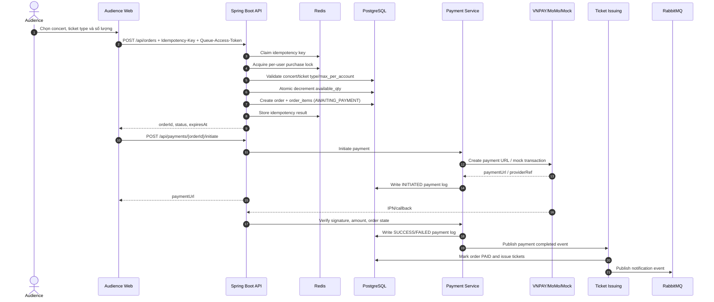

# Đặc tả luồng mua vé, thanh toán và phát hành e-ticket

## 1. Mục tiêu

Tài liệu này mô tả cách TicketBox tạo order, giữ tồn kho vé, khởi tạo thanh toán, xác nhận callback từ cổng thanh toán và phát hành e-ticket. Luồng này là critical path của hệ thống nên phải đảm bảo:

- Không oversell dù nhiều người cùng mua loại vé cuối cùng.
- Một tài khoản không mua vượt `max_per_account` bằng cách gửi nhiều request song song.
- Request retry không tạo order hoặc giao dịch thanh toán trùng.
- Callback payment trùng không phát hành ticket hai lần.
- Cổng thanh toán lỗi không kéo sập các chức năng khác như xem concert, check-in, guest import.
- Vé bị giữ bởi order chưa thanh toán phải được trả lại khi order hết hạn.

## 2. Thành phần tham gia

| Thành phần | Trách nhiệm |
|---|---|
| Audience Web | Gửi yêu cầu tạo order, khởi tạo thanh toán và redirect người dùng tới payment gateway. |
| Order API | Xác thực user, nhận request tạo order và kiểm tra idempotency key. |
| Order Service | Validate nghiệp vụ, giữ tồn kho, kiểm tra giới hạn vé/tài khoản và tạo order. |
| Concert/Ticket Type Module | Cung cấp thông tin concert/ticket type và cập nhật tồn kho bằng atomic update. |
| PostgreSQL | Lưu order, order item, ticket type inventory, payment log và ticket đã phát hành. |
| Redis | Lưu idempotency claim, per-user purchase lock và rate-limit state. |
| Payment Service | Khởi tạo payment URL, xác minh callback/IPN và đổi trạng thái order. |
| Payment Gateway Adapter | Đóng gói logic riêng của VNPAY/MoMo/mock provider như ký request, verify chữ ký, mapping response. |
| Circuit Breaker | Ngắt nhanh khi payment provider lỗi liên tục. |
| Ticket Issuing Listener | Phát hành e-ticket/QR khi payment được xác nhận thành công. |
| Scheduler | Hết hạn order chưa thanh toán và trả lại tồn kho. |

## 3. Dữ liệu và trạng thái chính

### 3.1 Trạng thái order

| Trạng thái | Ý nghĩa |
|---|---|
| `AWAITING_PAYMENT` | Inventory đã được giữ, user còn thời gian thanh toán. |
| `PAID` | Payment đã được xác nhận và ticket đã được phát hành. |
| `EXPIRED` | Hết thời gian thanh toán, inventory được trả lại. |
| `CANCELLED` | Order bị hủy. |
| `PAYMENT_FAILED` | Một lần thanh toán thất bại. |
| `REFUNDED` | Giao dịch đã thanh toán được hoàn tiền. |

Transition thành công chính:

```text
AWAITING_PAYMENT -> PAID
```

Transition timeout chính:

```text
AWAITING_PAYMENT -> EXPIRED
```

Order đã ở `EXPIRED`, `CANCELLED` hoặc `REFUNDED` không được tự động chuyển sang `PAID` nếu không có quy trình recovery có kiểm soát.

### 3.2 Payment logs

Payment activity được audit bằng các loại event:

- `INITIATED`
- `WEBHOOK_RECEIVED`
- `SUCCESS`
- `FAILED`
- `TIMEOUT`
- `REFUNDED`

Database cần có ràng buộc unique phù hợp trên payment log/provider reference để callback trùng không tạo nhiều kết quả thanh toán thành công.

### 3.3 Ý nghĩa tồn kho

`ticket_types.available_qty` đại diện cho số vé chưa bị giữ bởi active order. Inventory được giữ ngay khi tạo order, không chờ tới lúc payment thành công. Cách này tránh việc nhiều khách cùng được chuyển sang cổng thanh toán cho cùng một vé cuối cùng.

## 4. Luồng mua vé end-to-end



## 5. Tạo order

### 5.1 Request

`POST /api/orders` yêu cầu:

- JWT role `AUDIENCE`.
- Header `Idempotency-Key`.
- Queue/shopping-session token nếu concert đang trong luồng waiting room.
- `concertId`, `paymentProvider`, danh sách `ticketTypeId` và `quantity`.

User ID phải lấy từ security context, không nhận từ request body.

### 5.2 Idempotency

Trước khi xử lý order, service claim Redis key:

```text
idempotency:order:{idempotencyKey}
```

Hành vi:

- Nếu key chưa tồn tại, set trạng thái `PROCESSING` với TTL ngắn để claim request.
- Nếu key đang `PROCESSING`, request trùng nhận conflict/retry-later.
- Nếu key đã `COMPLETED:{orderId}`, backend trả lại kết quả đã lưu hoặc thông tin order tương ứng.
- Sau khi transaction tạo order commit, key được đổi sang `COMPLETED` và giữ trong TTL idempotency.

Database cũng lưu idempotency key trên order để có lớp bảo vệ bền vững nếu Redis mất dữ liệu.

### 5.3 Per-user purchase lock

Để chặn một user gửi nhiều request song song nhằm vượt `max_per_account`, service dùng Redis lock ngắn:

```text
purchase-lock:{userId}:{concertId}
```

Lock chỉ bao quanh đoạn validate limit và tạo order. Khi request kết thúc, lock được release bằng token/value để tránh xóa nhầm lock của request khác.

### 5.4 Validate nghiệp vụ

Order chỉ được tạo khi:

1. Concert tồn tại và đang bán.
2. Ticket type thuộc concert.
3. Ticket type active và còn trong sale window.
4. Quantity hợp lệ.
5. User chưa vượt `max_per_account` nếu cộng cả vé đã thanh toán và order/hold đang active.
6. Tồn kho đủ để giữ.
7. Payment provider được hỗ trợ.

Giá tiền phải lấy từ ticket type phía server, không tin giá do client gửi lên.

### 5.5 Chống oversell

Tồn kho được cập nhật bằng atomic update:

```sql
UPDATE ticket_types
SET available_qty = available_qty - :quantity
WHERE id = :ticketTypeId
  AND available_qty >= :quantity;
```

Nếu số dòng update là 0, nghĩa là không đủ vé. Request phải thất bại và không tạo order item. Đây là lớp bảo vệ quan trọng nhất vì mọi request song song cuối cùng đều phải cạnh tranh trên row trong PostgreSQL.

### 5.6 Persist order

Sau khi giữ tồn kho thành công:

- Tạo `orders` với trạng thái `AWAITING_PAYMENT`.
- Tạo `order_items`, mỗi dòng ứng với một ticket type.
- Lưu snapshot giá/subtotal tại thời điểm mua.
- Set `expires_at` để scheduler biết khi nào phải release inventory.

## 6. Khởi tạo thanh toán

`POST /api/payments/{orderId}/initiate` chỉ hợp lệ khi:

- User là chủ order.
- Order đang `AWAITING_PAYMENT`.
- Order chưa hết hạn.
- Provider hợp lệ.

Payment service tạo payment URL hoặc mock result, ghi `payment_logs` loại `INITIATED`, rồi trả payment URL cho frontend. Nếu provider lỗi hoặc circuit breaker đang open, API trả lỗi có kiểm soát, không ảnh hưởng concert browsing/check-in/admin.

## 7. Xác nhận thanh toán

Callback/IPN từ provider phải được kiểm tra:

1. Chữ ký hoặc secure hash hợp lệ.
2. Provider reference khớp giao dịch đã khởi tạo.
3. Amount khớp tổng tiền order.
4. Order tồn tại và đang ở trạng thái có thể thanh toán.
5. Callback trùng không được tạo ticket lần hai.

Nếu payment thành công, backend ghi payment log, chuyển order sang `PAID` và phát hành ticket trong transaction/idempotent handler. Nếu payment thất bại, order có thể giữ `AWAITING_PAYMENT` cho retry hoặc chuyển `PAYMENT_FAILED` tùy policy.

## 8. Phát hành ticket

Sau khi order `PAID`:

- Tạo đúng số lượng ticket theo `order_items`.
- Mỗi ticket có QR payload/signature riêng.
- Ticket gắn với owner, concert, ticket type và order item.
- Unique constraint bảo vệ không tạo ticket trùng cho cùng order item ngoài số lượng hợp lệ.
- Notification event được publish bất đồng bộ để gửi email/e-ticket.

Email lỗi không rollback order đã thanh toán; user vẫn xem được ticket trong tài khoản.

## 9. Circuit breaker và graceful degradation

Payment gateway là dependency ngoài nên cần timeout và circuit breaker:

| Trạng thái | Hành vi |
|---|---|
| `CLOSED` | Gọi provider bình thường. |
| `OPEN` | Không gọi provider, trả lỗi nhanh hoặc dùng mock/fallback trong môi trường demo. |
| `HALF_OPEN` | Cho một số request thử lại để kiểm tra provider đã phục hồi chưa. |

Khi payment provider lỗi:

- Payment initiation trả lỗi rõ ràng, ví dụ `503 Service Unavailable`.
- Order chờ thanh toán có thể hết hạn và trả lại vé.
- Concert list/detail, availability, auth, admin, check-in vẫn hoạt động nếu các dependency khác khỏe.

## 10. Kịch bản lỗi và xử lý

| Kịch bản | Cách xử lý |
|---|---|
| Hai user cùng mua vé cuối | Chỉ một atomic update thành công; request còn lại nhận sold out/insufficient inventory. |
| Một user gửi nhiều order song song | Redis per-user lock serialize request; limit tính cả order active nên không vượt `max_per_account`. |
| Client retry cùng `Idempotency-Key` | Trả lại kết quả cũ hoặc conflict nếu request đầu đang xử lý. |
| Client dùng nhiều idempotency key khác nhau | Per-user lock và limit trên database vẫn chặn vượt giới hạn. |
| Redis unavailable | Các chức năng phụ thuộc Redis suy giảm; database unique/atomic update vẫn là lớp bảo vệ cuối cho inventory. |
| Một ticket type trong order hết vé | Toàn bộ order thất bại, không giữ một phần mập mờ. |
| Payment callback trùng | Payment log/order state idempotent; không phát hành ticket lần hai. |
| Callback sai chữ ký | Từ chối callback, không đổi trạng thái order. |
| Callback amount sai | Ghi nhận lỗi/audit, không chuyển order sang `PAID`. |
| Callback tới sau khi order expired | Không tự động phát hành ticket; cần quy trình xử lý hoàn tiền/manual reconciliation. |
| App lỗi sau provider success | Payment log và callback có thể retry; handler idempotent giúp hoàn tất order an toàn. |
| Notification service lỗi | Order/ticket vẫn thành công; notification retry qua RabbitMQ/consumer. |
| Rate limit exceeded | Trả `429 Too Many Requests`, không tạo order. |

## 11. Quy tắc transaction và nhất quán

- Inventory decrement và tạo order phải nằm trong cùng transaction.
- Không phát hành ticket nếu payment chưa được xác nhận hợp lệ.
- Payment success handler phải idempotent.
- Expiration job chỉ release inventory cho order còn `AWAITING_PAYMENT`.
- Mọi kiểm tra ownership lấy user từ security context.
- Database constraint là lớp bảo vệ cuối cùng, Redis chỉ tăng tốc và điều phối.

## 12. Quy tắc bảo mật

- Order/payment/ticket API yêu cầu role `AUDIENCE`.
- Client không được truyền userId thay người khác.
- Payment webhook public nhưng bắt buộc verify chữ ký provider.
- Không log thông tin nhạy cảm như raw secure hash secret hoặc full card/payment credential.
- QR payload cần có chữ ký hoặc token không thể đoán.

## 13. Tiêu chí nghiệm thu

### Order và inventory

- Tạo order hợp lệ làm giảm `available_qty` đúng số lượng.
- Nếu không đủ vé, order không được tạo và `available_qty` không âm.
- Order hết hạn được scheduler chuyển `EXPIRED` và trả lại inventory.

### Giới hạn theo tài khoản

- Với `max_per_account = 2`, user không thể tạo các order active/paid tổng vượt 2 vé cho cùng ticket type.
- Request song song của cùng user không vượt giới hạn nhờ lock và kiểm tra database.

### Idempotency

- Gửi lại cùng `Idempotency-Key` không tạo order thứ hai.
- Request trùng khi request đầu đang xử lý nhận lỗi rõ ràng.

### Payment

- Callback hợp lệ chuyển order sang `PAID` và phát hành đúng số ticket.
- Callback trùng không phát hành ticket trùng.
- Callback sai chữ ký hoặc sai amount không đổi trạng thái order.
- Provider lỗi trả lỗi có kiểm soát và không ảnh hưởng API không liên quan.

### Tính đúng đắn

- Không có trạng thái order/ticket mập mờ sau lỗi giữa chừng.
- Payment log đủ để audit một giao dịch.
- Ticket đã phát hành có thể được tải/xem bởi đúng owner.
