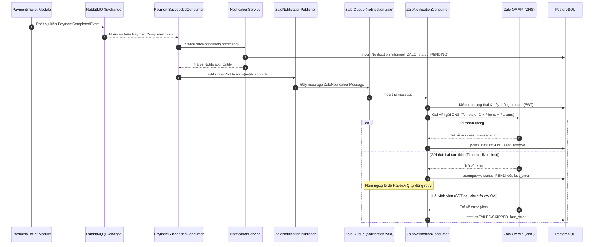

# Thiết kế mở rộng: Tích hợp Zalo OA (Zalo Notification Service - ZNS)

Tài liệu này mô tả thiết kế kỹ thuật để tích hợp kênh thông báo **Zalo OA (Zalo Official Account - ZNS)** vào hệ thống thông báo (`Notification Module`) của TicketBox mà không ảnh hưởng đến luồng nghiệp vụ mua vé chính (tuân thủ nguyên lý Open/Closed).

---

## 1. Tổng quan kiến trúc & Mục tiêu

Hệ thống thông báo của TicketBox được thiết kế theo mô hình **Event-Driven (hướng sự kiện)** và tách biệt bằng **Message Queue (RabbitMQ)**. Khi luồng mua vé kết thúc thành công, hệ thống chỉ phát ra sự kiện `PaymentCompletedEvent` lên RabbitMQ. 

Việc tích hợp thêm kênh Zalo OA sẽ được thực hiện độc lập hoàn toàn trong module `notification` bằng cách lắng nghe sự kiện này, tạo bản ghi thông báo và xử lý gửi tin nhắn bất đồng bộ qua một hàng đợi riêng biệt.

---

## 2. Thiết kế Thành phần tham gia

Để thêm kênh Zalo OA, các thành phần sau sẽ được bổ sung hoặc mở rộng trong module `notification`:

```text
[PaymentCompletedEvent] (RabbitMQ)
       │
       ▼
[PaymentSucceededConsumer] (Lắng nghe sự kiện)
       │
       ├─► Tạo Notification (channel=EMAIL) ─► [Email Queue] ─► [EmailConsumer]
       │
       └─► Tạo Notification (channel=ZALO)  ─► [Zalo Queue]  ─► [ZaloConsumer] ──► [Zalo API]
```

### Chi tiết các lớp mở rộng:

| Thành phần | Trách nhiệm | Loại file |
|---|---|---|
| `Notification.Channel` | Bổ dung enum `ZALO` (đã có sẵn trong code). | Mở rộng |
| `RabbitMqNames` | Định nghĩa tên queue `notification.zalo` và routing key `notification.zalo.send`. | Mở rộng |
| `RabbitMqConfig` | Cấu hình các Bean cho Queue, Binding và Dead-Letter Queue (DLQ) cho Zalo. | Mở rộng |
| `ZaloNotificationMessage` | DTO chứa thông tin task gửi tin nhắn (ví dụ: `notificationId`). | Tạo mới |
| `ZaloNotificationPublisher` | Đẩy `ZaloNotificationMessage` vào queue `notification.zalo`. | Tạo mới |
| `ZaloNotificationConsumer` | Tiêu thụ message từ queue, gọi Zalo API và cập nhật trạng thái gửi vào DB. | Tạo mới |
| `ZaloClient` | Trình gọi API (Client) tích hợp với Zalo Official Account API. | Tạo mới |

---

## 3. Thiết kế luồng xử lý (Sequence Diagram)

### Luồng gửi tin nhắn Zalo xác nhận sau mua vé:



---

## 4. Đặc tả RabbitMQ & Database

### Cấu hình RabbitMQ:
* **Exchange:** `ticketbox.events` (Topic Exchange)
* **Zalo Queue:** `notification.zalo` (Durable)
* **Routing Key:** `notification.zalo.send`
* **Dead Letter Exchange (DLX):** `ticketbox.dlx`
* **Dead Letter Queue (DLQ):** `notification.zalo.dlq` (Dùng để hứng các tin nhắn lỗi quá 3 lần).

### Cấu hình Database:
Bảng `notifications` lưu trữ dữ liệu thông báo với các trường:
* `channel` = `'ZALO'`
* `status` = `'PENDING'` | `'SENT'` | `'FAILED'` | `'SKIPPED'`
* `reference_id` = `order_id` (Dùng để truy vết đơn hàng)
* `attempts` = Số lần thử lại gửi tin nhắn qua API Zalo.

---

## 5. Xử lý kịch bản lỗi & Ràng buộc (Fault Tolerance)

1. **Lỗi API Zalo (Hết hạn Access Token / Lỗi mạng):**
   * Đánh dấu lỗi vào trường `last_error` trong bảng `notifications`.
   * Message sẽ được đưa lại hàng đợi và retry (tối đa 3 lần).
   * Sau 3 lần thất bại, message được đưa vào DLQ và trạng thái chuyển thành `FAILED` để Admin có thể kiểm tra và bấm "Retry" thủ công trên hệ thống quản trị.
2. **Khách hàng chưa đăng ký số điện thoại hoặc định dạng SĐT không đúng:**
   * Hệ thống sẽ tự động chuyển trạng thái thông báo thành `SKIPPED` kèm lý do lưu vào `last_error` và ACK message để giải phóng hàng đợi, tránh tắc nghẽn.
3. **Idempotency (Đảm bảo không gửi trùng):**
   * Trước khi gửi, `ZaloNotificationConsumer` kiểm tra trạng thái thông báo trong DB. Nếu trạng thái là `SENT`, tin nhắn sẽ bị bỏ qua (Skip).
   * `message_id` của thông báo Zalo được tạo bằng thuật toán UUID dựa trên chuỗi `"PAYMENT_SUCCEEDED:ZALO:" + orderId` để đảm bảo mỗi đơn hàng chỉ có duy nhất 1 bản ghi gửi Zalo.

---

## 6. Tiêu chí nghiệm thu (Acceptance Criteria)

* [ ] Hệ thống thanh toán và mua vé không bị thay đổi mã nguồn khi thêm kênh Zalo OA.
* [ ] Khi mua vé thành công, hệ thống tạo bản ghi thông báo kênh `ZALO` trong DB ở trạng thái `PENDING`.
* [ ] Tin nhắn Zalo được gửi bất đồng bộ qua queue `notification.zalo`.
* [ ] Trạng thái của thông báo Zalo trong DB chuyển thành `SENT` và lưu thời gian `sent_at` sau khi Zalo API phản hồi thành công.
* [ ] Nếu Zalo API bị lỗi hoặc quá tải, tiến trình đặt vé và thanh toán của khách hàng không bị gián đoạn hay chậm trễ.
